# PSX OG Nova Develop — полная карта проекта

> Назначение документа: дать человеку, который впервые открыл репозиторий, цельную и проверяемую модель проекта — от исходников и сборки до сетевых маршрутов, состояний автофарма, очистки runtime и выпуска готового `toolofmind.lua`.
>
> Карта описывает фактически активную сборку `1.4.1-candidate.54.4-core-rescue`, а не все когда-либо существовавшие эксперименты в репозитории.

## 0. Зафиксированная точка аудита

| Поле | Значение |
|---|---|
| Ветка | `candidate/c54-core-rescue-20260814` |
| Git HEAD во время аудита | `3a54e96e69929e99435448d0858d5ad0548f22a9` |
| Контрольный тег | `candidate-c54.4-core-rescue-20260814` |
| Suite/runtime version | `1.4.1-candidate.54.4-core-rescue` |
| Главный исходник | `slim_farm.lua` |
| Публичный собранный файл | `toolofmind.lua` |
| Эквивалентный loader artifact | `loader.lua` |
| Manifest | `runtime_manifest.json` |
| Каноническая сборка | `node build_slim.js` |
| Зафиксированный source commit модулей | `04f05d8338e9aa2c6c39168972ca9c50b489586e` |

Если эта карта читается после дальнейших изменений, сначала сравнить верхние значения с `git rev-parse HEAD`, `git describe --tags --always` и полями `suite`/`modules` в `runtime_manifest.json`. Manifest и активный код имеют приоритет над числовыми значениями в документации.

## 1. Модель проекта за пять минут

Проект состоит не из одного гигантского независимого скрипта. `slim_farm.lua` является **composition root**: он создаёт runtime, загружает библиотеку игры и UI, собирает контексты, лениво запускает специализированные модули и владеет общей игровой моделью монет, настройками, UI и жизненным циклом.

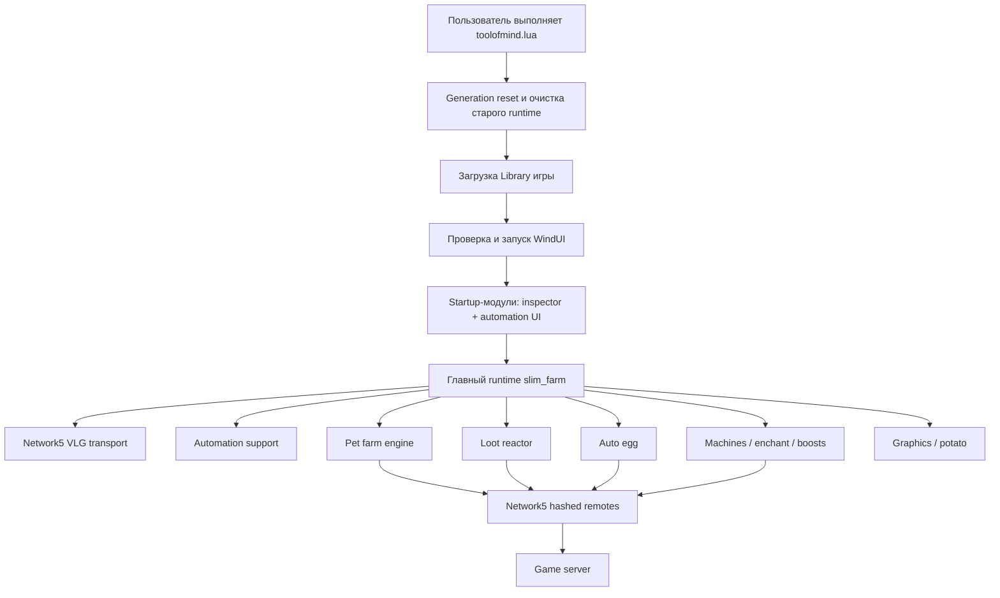

Ключевые принципы текущей архитектуры:

1. **Manifest-driven build.** Активные файлы, версии, хеши и роли перечислены в `runtime_manifest.json`; незаявленный файл ломает каноническую сборку.
2. **Generation ownership.** Каждый запуск получает поколение и token. Старые callbacks должны перестать действовать после reload/STOP.
3. **Ленивые модули.** Машины, boosts, eggs и другие подсистемы не обязаны запускаться одновременно при старте.
4. **Единая локальная модель монет.** Main runtime принимает начальный snapshot и `New/Update/Remove Coin`; farm engine получает уже выбранные ID и не сканирует игру сам.
5. **Network4 resolver.** Команда определяется логическим именем и видом remote, а живой хеш/remote извлекается из текущих Network4/Network5 таблиц. Жёстко зашитый remote не является источником истины.
6. **Event-driven boss path.** Для boss chest нормальный цикл — `New Coin` → один grouped Join → работа → `Remove Coin` → ожидание следующего `New Coin`.
7. **Producer-gated loot.** По возможности ID орбов/мешков перехватываются до создания локальной физики и визуала; fallback только читает ID и не двигает объекты.
8. **Fail closed для разрушительных действий.** Неясный каталог пета, отсутствующая защита, неизвестное подтверждение покупки/удаления — причина ничего не отправлять, а не гадать.

## 2. Источники истины и порядок доверия

При конфликте сведений использовать следующий порядок:

1. `runtime_manifest.json` — какие файлы активны, их версии, commit и контрольные суммы.
2. `slim_farm.lua` и перечисленные manifest-модули — фактическое runtime-поведение.
3. `build_slim.js` — что реально попадает в artifact и какие проверки обязательны.
4. Тесты — зафиксированные инварианты и регрессии.
5. `PROJECT_ARCHITECTURE_MAP.md` — общая карта и объяснение связей.
6. `PROJECT_EVIDENCE_ARCHIVE.md` — локальные каталоги, Cobalt/DEX/MicroProfiler/session logs, Git-хронология и накопленные наблюдения.
7. `NETWORK4_ROUTE_MANIFEST.md` — тематический справочник сетевых команд.
8. `PROJECT_LAYOUT.md` — более ранняя обзорная документация; отдельные числа в ней исторические.
8. `legacy`/`payload` и старые builders — не считать активными только из-за похожих имён.

Например, старое описание могло упоминать 8 farm lanes или flush орбов через 0.25 секунды. В зафиксированной сборке активны 16 farm lanes, очередь dispatch размером 32 и orb flush около 0.65 секунды с пакетом от 8 до 32 ID.

## 3. Карта репозитория

### 3.1 Активные исходники

| Файл | Роль | Загружается когда |
|---|---|---|
| `slim_farm.lua` | Composition root: startup, общая state-модель, UI, coin catalog, farm allocator, конфиг, shutdown | Всегда, внутри generated artifact |
| `request_state_inspector.lua` | Пассивный bounded inspector запросов, ping, очередей и incidents | Startup, optional |
| `network4_transport_module.lua` | Resolver хешированных remotes и безопасный Invoke/Fire ladder | Lazy, при первом сетевом пользователе |
| `automation_support_module.lua` | Mutex операций с inventory, каталог Pixel Demon, enchant matcher, route health | Lazy, при automation UI/машинах |
| `automation_ui_module.lua` | UI яиц, машин, boost, enchant rules и привязка контролов | Startup, required |
| `pet_farm_lite_engine.lua` | Ограниченная очередь grouped Join, dispatch и жизненный цикл UID | Предзагружается после UI, работает при Auto Farm |
| `loot_reactor.lua` | Producer gates и сбор Orbs/Lootbags без retention визуальной физики | Через ~0.75 с, потому что loot по умолчанию включён |
| `auto_egg_module.lua` | Каталог яиц, preflight, покупка, ACK, adaptive/manual delay, headless | Lazy при использовании egg UI/Auto Hatch |
| `enchant_module.lua` | Быстрый последовательный enchant одного equipped пета до совпадения | Lazy при Auto Enchant |
| `gold_machine_module.lua` | Normal Pixel Demon → Golden, с protection rules | Lazy при включении Gold |
| `rainbow_machine_module.lua` | Golden Pixel Demon → Rainbow, с отдельными rules | Lazy при включении Rainbow |
| `dark_matter_module.lua` | Rainbow Pixel Demon → DM, claim и безопасный DM cleanup | Lazy при включении DM функций |
| `boost_module.lua` | Продление boost и покупка bundle при нулевом stock | Lazy при включении boosts |
| `graphics_module.lua` | Bounded anti-lag/potato очередь и FPS cap | Lazy при изменении graphics-настроек |

### 3.2 Generated artifacts

| Файл | Назначение | Можно редактировать вручную? |
|---|---|---|
| `toolofmind.lua` | Публичный monolithic artifact для `loadstring(game:HttpGet(...))()` | Нет |
| `loader.lua` | Идентичный по байтам canonical loader artifact | Нет |

Оба файла генерируются из одних источников и должны быть идентичны. Любой ручной фикс внутри них потеряется при следующем `node build_slim.js` и создаст расхождение source/artifact.

### 3.3 Vendor

| Файл | Роль |
|---|---|
| `vendor/WindUI-1.6.64-fix.lua` | Зафиксированная UI-библиотека с известной identity и guarded resize fix |

Runtime не должен бесконтрольно принимать неизвестную версию WindUI. Build и startup сверяют ожидаемые identity-поля.

### 3.4 Build и manifest

| Файл | Роль |
|---|---|
| `runtime_manifest.json` | Полный список классифицированных файлов, module order, commits, hashes, build identity |
| `build_slim.js` | Единственный canonical builder и компактор Luau |
| `.gitattributes` | Нормализация файлов/переносов для воспроизводимых hash |

### 3.5 Документация

| Файл | Роль |
|---|---|
| `PROJECT_ARCHITECTURE_MAP.md` | Эта полная карта проекта |
| `PROJECT_EVIDENCE_ARCHIVE.md` | Полный внешний архив знаний: локальные папки, captures, dumps, переписка и доказанные выводы |
| `NETWORK4_ROUTE_MANIFEST.md` | Справочник маршрутов, аргументов и подтверждений |
| `PROJECT_LAYOUT.md` | Старый обзор layout и исторических решений |

### 3.6 Legacy

Manifest относит к legacy старые builders (`build_binary_loader.js`, `build_loader.js`, `build_modular.js`, `build_staged_loader.js`, `build_standalone.js`), прежний `core.lua`, диагностические/menu/native UI файлы, старый `pet_farm_engine.lua` и содержимое `payload/`.

Правило: **legacy-файл не активен, пока его путь не присутствует в `moduleOrder`, source/vendor/build секции manifest и не достигается из canonical builder**. Похожее имя не означает, что runtime его требует.

### 3.7 Tests

В `tests/` находится 36 активных тестов. Они покрывают manifest/build, transport, ping stability, farm lifecycle, boss chest, loot, eggs, машины, enchant rules, cleanup, rewards, rolling currency и generation cleanup. Полный индекс приведён в разделе 27.

## 4. Активный граф зависимостей

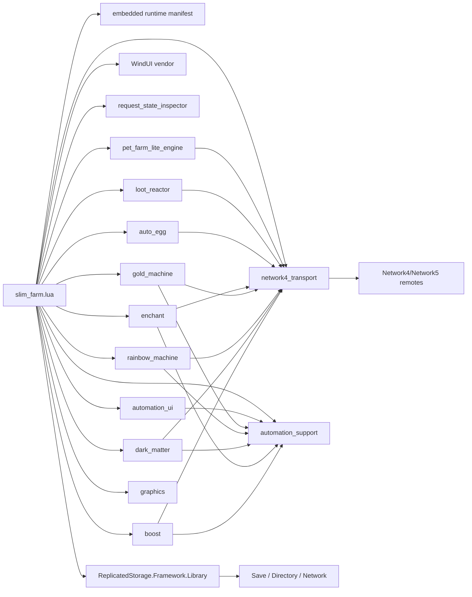

Важная граница: модули не должны самовольно искать глобальный runtime друг друга. Main передаёт им небольшой `context` с функциями чтения состояния, сетевыми адаптерами, callbacks, статусом и generation. Это позволяет заменять модуль, не делая его владельцем всего проекта.

## 5. Manifest и воспроизводимая сборка

### 5.1 Что гарантирует `runtime_manifest.json`

Manifest содержит:

- версию suite;
- главный исходник;
- порядок активных модулей;
- путь, версию, способ проверки версии и pinned identity каждого модуля;
- startup/lazy режим;
- vendor identity;
- generated artifacts;
- классификацию source/build/docs/legacy/tests;
- SHA-256, DJB2 и размер последней сборки.

Это не декоративный файл. `build_slim.js` завершится ошибкой, если:

- repository-файл не отнесён ровно к одной категории;
- два модуля используют одинаковый key/path;
- active module отсутствует в `moduleOrder` или наоборот;
- версия модуля несовместима с suite;
- локальный файл отличается от blob в закреплённом commit;
- размер/SHA-256/DJB2 не совпадают;
- WindUI имеет другую identity;
- `VERSION` в main не совпадает с suite;
- source содержит не один manifest marker;
- компактор изменяет token stream Luau.

### 5.2 Порядок модулей

| № | Key | Version | Startup policy |
|---:|---|---:|---|
| 1 | `requestInspector` | 1.0.2 | startup optional/passive |
| 2 | `networkTransport` | 1.3.0 | lazy |
| 3 | `automationSupport` | 1.5.0 | lazy |
| 4 | `automationUI` | 1.5.3 | startup required |
| 5 | `petFarmEngine` | 1.4.3 | lazy, preloaded after UI |
| 6 | `lootReactor` | 3.8.0 | lazy, deferred start |
| 7 | `autoEgg` | 1.7.0 | lazy |
| 8 | `enchant` | 1.0.1 | lazy |
| 9 | `goldMachine` | 1.5.0 | lazy |
| 10 | `rainbowMachine` | 1.5.0 | lazy |
| 11 | `darkMatter` | 1.5.1 | lazy |
| 12 | `boost` | 1.2.0 | lazy |
| 13 | `graphics` | 4.1.0 | lazy |

### 5.3 Build pipeline

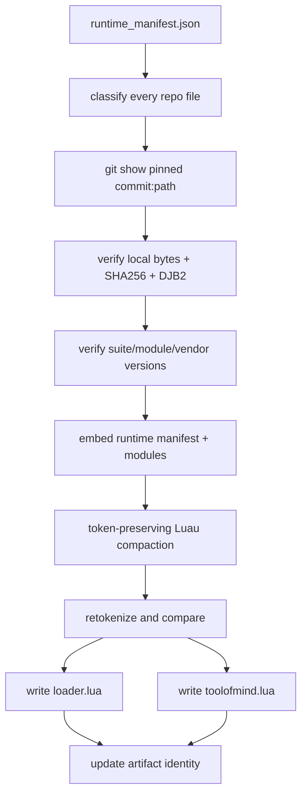

Canonical команда:

```powershell
node build_slim.js
```

После неё `loader.lua` и `toolofmind.lua` должны совпадать. Source или module нельзя «быстро поправить» только в artifact.

## 6. Startup: что происходит после execute

### 6.1 Общая последовательность

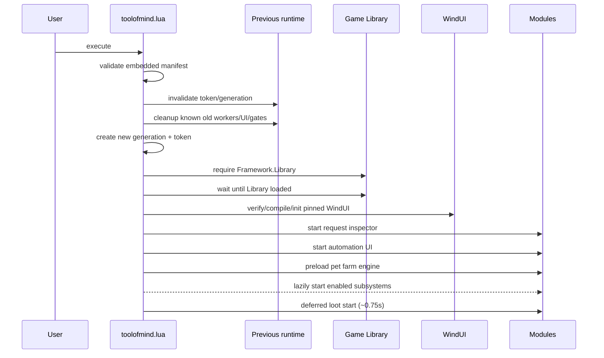

### 6.2 Почему runtime начинается с очистки

Executor запускает новый chunk в той же Roblox-сессии. Старый chunk может оставить:

- `task.spawn`/`task.delay` callbacks;
- RBXScriptConnections;
- UI и HUD;
- producer gates в игровых LocalScripts;
- очереди farm/loot;
- старые globals/tokens;
- незавершённые operation gates.

Поэтому main сначала увеличивает `PSX_OG_RUNTIME_GENERATION`, заменяет `PSX_OG_SLIM_TOKEN`, вызывает известные cleanup-функции, останавливает старые состояния и удаляет stale GUI. Все новые callbacks проверяют `running()`, то есть совпадение token и generation.

Ограничение: уже отправленный `InvokeServer` нельзя физически отменить. Reload может сделать результат неизвестным; поэтому destructive/purchase операции не должны автоматически повторяться без нового подтверждения состояния.

### 6.3 Стабильное распределение старта между аккаунтами

Automation-задачи получают небольшой deterministic startup phase на основе `UserId` и lane. Цель — не отправлять на сервер одинаковую серию rewards/machine/boost запросов с десяти клиентов в одну миллисекунду. Farm и loot из этой общей задержки исключены, потому что их реакция привязана к живым игровым событиям.

### 6.4 Загрузка Library

Main получает `ReplicatedStorage.Framework.Library`, ждёт готовности библиотеки и только после этого строит Directory/Save/Network зависимости. Отсутствие Library — startup blocker: продолжение с выдуманными каталогами или remotes небезопасно.

### 6.5 Загрузка WindUI

Проверяются ожидаемые bytes/hash, применяется узкий guarded resize patch, затем код компилируется и инициализируется. UI folder: `PSX_Nova_Stable`, окно: `PSX OG | Nova Develop`, базовый размер 820×570, клавиша показа — Right Shift.

### 6.6 Remote module loader

Main сериализует загрузку модулей, чтобы несколько контролов не компилировали один модуль одновременно. Для каждого key:

1. берётся manifest descriptor;
2. ищется generation-scoped cache;
3. при необходимости загружается pinned blob;
4. сверяются bytes/DJB2 и версия;
5. chunk компилируется;
6. exported factory получает action/context;
7. результат кешируется только для текущей generation.

Предельное ожидание загрузчика — около 45 секунд; между неудачными попытками есть небольшой cooldown. Ошибка required startup module останавливает соответствующую стадию, optional inspector не должен ломать основной runtime.

## 7. Владение состоянием и жизненный цикл

### 7.1 Иерархия состояния

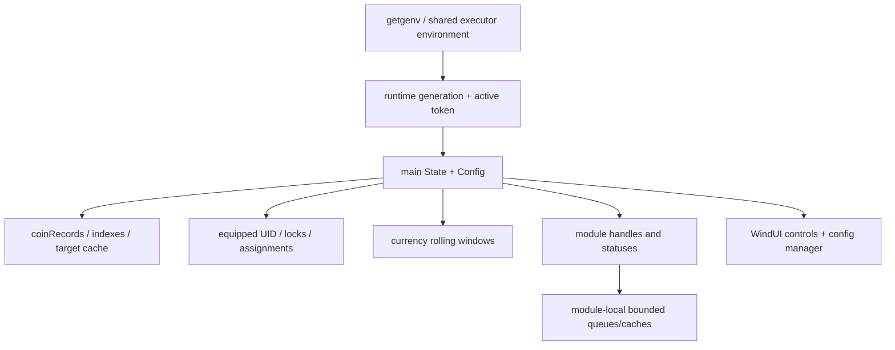

`getgenv()` используется только как верхний ownership-механизм между переэкзекутами. Долгоживущая игровая логика должна жить в main/module state, а не в бесконтрольном наборе global-флагов.

### 7.2 Generation guard

Каждая delayed/spawned операция обязана проверять, что:

- active token всё ещё её token;
- generation не изменилась;
- subsystem всё ещё enabled;
- относящийся к операции UID/coin/purchase всё ещё актуален.

Generation guard предотвращает наиболее опасный класс reload-регрессий: старый worker получает управление после запуска новой версии и отправляет повторную команду.

### 7.3 Что принадлежит main, а что модулю

| Данные | Владелец | Кто читает |
|---|---|---|
| `Config` и UI flags | Main/UI | Все модули через context callbacks |
| Полный каталог текущих монет | Main | Allocator, telemetry, loot recovery |
| Выбор цели и zone/world фильтр | Main | Farm engine получает готовый target ID |
| Очередь Join/dispatch и UID runtime | Farm engine | Main через stats/callbacks |
| Orb/Lootbag pending records | Loot reactor | Inspector/status через stats |
| Route cache и hashed remotes | Network transport | Все сетевые модули |
| Inventory operation owner | Automation support | Machines/enchant/boost/egg cleanup |
| Egg lifecycle state | Auto egg | UI/inspector через status |
| Machine pending UIDs | Соответствующая machine module | Main UI/status |
| Rolling balance samples | Main | Monitor и Quick HUD |
| Passive event history | Inspector | Только inspector UI/snapshot |

### 7.4 STOP и reload

STOP не равен простому скрытию UI. Он должен:

- выключить все Config toggles;
- инвалидировать token/generation;
- отменить module workers;
- disconnect все RBXScriptConnections;
- очистить dispatch/pending/pool/cache;
- восстановить перехваченные producer functions;
- удалить main UI, HUD и inspector;
- снять ownership operation gate;
- очистить network route cache текущей generation.

## 8. Конфигурация и UI

### 8.1 Основные вкладки

| Вкладка | Что настраивает |
|---|---|
| Farm | Включение farm, стратегия целей, boss mode, world/zone, boss diagnostics/instant arrival |
| Monitor | Live assignment/controller health, currency rate, Quick HUD и видимость строк |
| Eggs | Egg catalog/scope, x1/x3, adaptive/manual delay, Headless/Native, Auto Hatch |
| Machines | Gold, Rainbow, Dark Matter, batch/time, claim, DM cleanup, enchant protection rules |
| Boosts | Автопродление четырёх boost и fallback покупки bundle |
| Loot | Orbs, Lootbags и producer-gated режимы |
| Rewards | VIP, Rank, Free Gifts и Diamond pack |
| Graphics | Potato/anti-lag и FPS cap |
| Session | Config save/load/autoload, диагностика, STOP/reload-related controls |

### 8.2 Значимые defaults

| Настройка | Default |
|---|---|
| Auto Farm | Off |
| Farm mode | Different Strongest |
| World/Zone | Current World / Player Zone |
| Track currency | Active Balances |
| Collect Orbs / Lootbags | On / On |
| Anti-AFK | On |
| Potato | Off |
| Auto Egg/Machines/Boosts/Rewards | Off |
| Egg purchase | x1, Headless, Adaptive, manual delay 0 |
| Machine batch | 6 |
| Dark Matter batch/time | 6 / 0 hours |
| Protection profile | Rainbow Coins AtLeast V для Gold/Rainbow/DM |
| DM cleanup | Disabled, Newly Claimed, Dry Run on, confirm off, batch 25 |
| Boss diagnostics | On |
| Boss instant arrival | Off |
| Quick HUD | On, строки видимы |

### 8.3 Config storage

WindUI ConfigManager хранит профиль `default` в папке `PSX_Nova_Stable`. Сохраняются flagged controls, выбранные world/zone/egg/scope и отдельные enchant rule profiles.

Autoload выполняется после инициализации UI с небольшой задержкой. World восстанавливается раньше Zone, потому что список зон зависит от выбранного мира. Enchant rules импортируются с validation и ограничением размера; непроверенный огромный JSON не должен блокировать scheduler.

### 8.4 Конструктор enchant rules

Для Gold, Rainbow, Dark Matter и DM Auto Delete существуют независимые профили. В одном профиле:

- каждое правило — отдельная OR-ветка;
- внутри правила до трёх условий соединяются AND;
- правило имеет понятное имя/summary и enabled-флаг;
- enchant выбирается из динамического каталога Directory.Powers плюс compatibility names;
- match mode: Any, Exact, IV/V или AtLeast;
- профиль можно экспортировать/импортировать;
- удаление DM имеет scope `Newly Claimed` или `All DM` и обязательные safety controls.

Пример:

```text
Rule 1: Super Teamwork
OR
Rule 2: Royalty AND Rainbow Coins V
```

Защищён будет пет, совпавший хотя бы с одной веткой. Для машин защищённые не идут в craft; для DM cleanup совпавшие остаются, остальные подходящие DM Pixel Demon могут быть удалены только после Dry Run/confirm/scope проверок.

## 9. Module API и передаваемые контексты

### 9.1 Почему используется context injection

Main передаёт модулю только разрешённые зависимости. Например farm engine получает `Running`, `Enabled`, route adapters, callbacks состояния и лимиты, но не владеет всем `Config`. Это уменьшает скрытые зависимости и делает STOP/reload проверяемым.

### 9.2 Контракт по модулям

| Модуль | Основные actions/handle | Критичные context зависимости |
|---|---|---|
| Inspector | start/stop/state/snapshot | generation, ping, module stats, bounded status publishers |
| Network transport | resolve/invoke/fire/invalidate/stats/clear/version | Library, ReplicatedStorage, Game identity, upvalue accessor |
| Automation support | acquire/release/cancel gate, catalog, enchant matcher, route health | Library Save/Directory, route adapters, generation |
| Automation UI | build UI/status/rule profiles | WindUI tabs, Config accessors, module starters |
| Farm engine | start/dispatch/limit/pump/reset/stop/stats/boss events/version | enabled/running, 4 farm routes, callbacks, width/spacing |
| Loot reactor | start/sync/stop/stats/version | game producers, route Fire, coin readiness, Things, RTT |
| Auto egg | start/stop/catalog/inspect/invalidate | Library, player, egg config, Invoke/Fire, operation gate |
| Enchant | start/stop/match/status | equipped inventory, Save, Invoke, operation gate |
| Gold/Rainbow | start/stop/status/policy | snapshot, Pixel Demon catalog, rule matcher, machine routes |
| Dark Matter | create/claim/cleanup/stop/status | snapshot, server clock, routes, matcher, destructive guards |
| Boost | start/stop/status | Save, currency, boost/bundle routes, phase |
| Graphics | apply/stop/status | game roots, FPS cap, token/generation |

### 9.3 Ошибки context boundary

Если модуль начинает сам:

- выполнять `getgc` на каждом tick;
- строить второй coin catalog;
- читать/писать чужие global flags;
- повторно подключаться к тем же Network events;
- создавать независимый inventory scanner;

он нарушает карту владения и почти неизбежно создаёт лишний CPU/network fan-out. Такие изменения должны рассматриваться как архитектурная регрессия.

## 10. Network4/Network5 transport

### 10.1 Логическая identity маршрута

Маршрут описывается парой:

```text
(remote kind, logical command)
```

где `kind=1` — RemoteEvent, `kind=2` — RemoteFunction. Логическое имя стабильно для кода проекта, а фактический hashed name может меняться.

### 10.2 Откуда берётся живой remote

Resolver сначала исследует текущие upvalues `Library.Network.Fire`/`Invoke`:

- upvalue 1 — hasher/связанный hash map;
- upvalue 2 — direct remote maps;
- upvalue 6 — bridge maps в текущем layout;
- compatibility scan проверяет upvalues 1..8 без вызова неизвестных accessors.

Кандидат принимается только если:

- имеет нужный Roblox class;
- находится под `ReplicatedStorage`;
- соответствует ожидаемому kind;
- bridge имеет допустимую структуру/parent;
- логическая команда совпала с live map или проверенной alias-кандидатурой.

### 10.3 Hash fallback

Если live map не отдаёт готовый route, cold path вычисляет актуальный VLG hash из identity текущей сессии:

```text
sha256(
  "PSXOG:SECRET:NETWORK:VLG:12910259120591716249102/Network5/" +
  GameId + "/" + PlaceId + "/" + PlaceVersion + "/" + JobId + "/" +
  kind + "/" + command
):sub(5, 36)
```

После materialization игра переименовывает remote в `RemoteEvent` или
`RemoteFunction`, сохраняя исходный hash в атрибуте `NetworkHash`. Поэтому
разрешён один bounded direct-child scan по этому атрибуту. Plain DJB2 остаётся
только legacy-кандидатом. Любой найденный remote всё равно проходит structural
validation; одного имени или атрибута недостаточно.

### 10.4 Invoke/Fire ladder

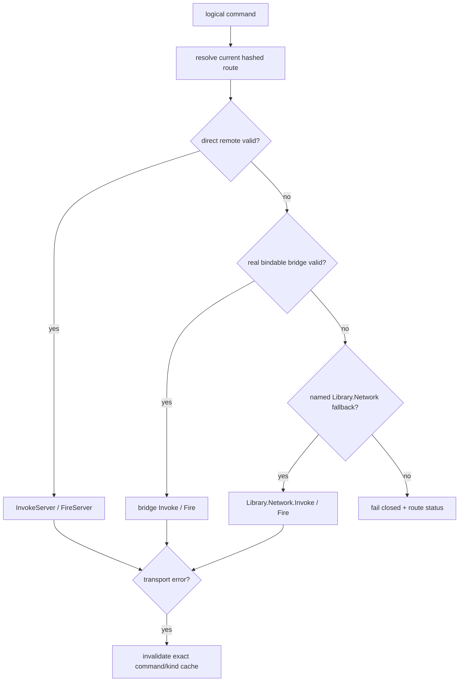

Важно: успешный `FireServer` означает, что транспорт принял локальный вызов, но не доказывает server ACK. Подтверждение должно приходить отдельным inbound event или изменением Save/Inventory.

### 10.5 Alias-команды farm

| Каноническая команда | Допустимый alias |
|---|---|
| Get Coins | Get The Coins |
| Change Pet Target | Change Pet Target NOW |
| Join Coin | Join The Coin |
| Farm Coin | Farm The Coin |
| Leave Coin | Leave The Coin |

Alias нужен для совместимости конкретного обновления игры, но cache всё равно привязан к точной logical command identity.

### 10.6 Кеширование и invalidation

- Cache generation-scoped: старый remote не переносится в новый execute.
- Cache key включает kind + logical command.
- Ошибка одного маршрута инвалидирует только его, а не все remotes.
- Route resolution не выполняется на каждый pet/orb, если живой cached route остаётся валиден.
- Re-resolution не должна превращаться в фоновой бесконечный scan.

## 11. Полная карта outbound/inbound команд

### 11.1 RemoteFunctions

| Команда | Подсистема | Типичные аргументы | Чем подтверждается | Replay policy |
|---|---|---|---|---|
| Get Coins | Coin sync/recovery | world/area context игры | таблица snapshot | Можно ограниченно повторить только при transport fail |
| Join Coin | Farm | coin ID + массив pet UID | response/accepted UID + coin events | Reject terminal для этой монеты; transport retry ограничен |
| Leave Coin | Farm cleanup | coin ID + UID/list | локальная очистка + события | Не спамить |
| Buy Egg Yay | Eggs | egg name + x1/x3 | hatch event или точная inventory delta | Никогда не overlap; неизвестный результат не дублировать |
| Delete Several Pets | Egg cleanup/DM cleanup | массив UID | inventory delta | Только после свежей revalidation и destructive guards |
| Enchant Pet | Enchant | pet UID | powers delta в Save | Один in-flight |
| Get Golden Machine Info | Gold | info request | server tiers/info | Read-only, редкий refresh |
| Use Golden Machine | Gold | выбранные UID | inventory transformation | Operation gate + pending UID |
| Get Rainbow Machine Info | Rainbow | info request | server tiers/info | Read-only, редкий refresh |
| Use Rainbow Machine | Rainbow | выбранные UID | inventory transformation | Operation gate + pending UID |
| Get Dark Matter Machine Info | DM | info request | queue slots | Read-only, bounded refresh |
| Get OSTime | DM/rewards clock | нет/command-specific | server time | Кешировать/редко обновлять |
| Convert To Dark Matter | DM create | UID batch/count | queue slot/info delta | Не повторять неизвестный result |
| Redeem Dark Matter Pet | DM claim | slot/id | inventory + slot delta | Только completed slot |
| Buy Boost Bundle | Boost | bundle context | stock/currency delta | Только stock=0 и один gate owner |
| Redeem VIP Rewards | Rewards | command-specific | timer/reward state | Только due |
| Redeem Rank Rewards | Rewards | command-specific | timer/reward state | Только due |
| Redeem Free Gift | Rewards | gift index | claimed index | Один раз на доступный index |
| Buy DiamondPack | Rewards/pack | pack tier | currency/balance delta | Проверка 12.5B Halloween Candy + 0.5B reserve; выбираемый интервал 30–300s |

### 11.2 RemoteEvents

| Команда | Подсистема | Payload | Ограничение |
|---|---|---|---|
| Change Pet Target | Farm | pet UID + coin ID/target | После accepted Join, не как probe |
| Farm Coin | Farm | pet UID + coin ID | После accepted Join, dedupe TTL |
| Claim Orbs | Loot | массив orb ID | Batch 8–32, dedupe, ACK retention |
| Collect Lootbag | Loot | lootbag ID | До 4 lanes, bounded retry, safe removal |
| Activate Boost | Boost | boost name | Только в renewal window |

### 11.3 Inbound события

| Событие | Кто принимает | Эффект |
|---|---|---|
| New Coin | Main/farm | добавить/обновить coin record; в boss mode открыть новый generation cycle |
| Update Coin Health | Main/farm | обновить health/progress lease |
| Update Coin Pets | Main/farm | уточнить membership/assignment без тяжёлого слежения чужих pets |
| Remove Coin | Main/farm | удалить target, освободить UID, закончить boss cycle |
| openegggg / Open Egg | Auto egg | server ACK покупки/содержимое hatch |
| AddOrb/Remove Orb | Loot | enqueue ID / подтвердить исчезновение |
| Spawn Lootbag/Remove Lootbag | Loot | enqueue owner-aware record / ACK cleanup |

## 12. Общая модель данных

### 12.1 Coin record

Main нормализует серверные/локальные сведения примерно в следующую сущность:

```text
CoinRecord
  id
  name/type
  health/maxHealth
  area/zone/world
  position/model (если доступны)
  removed/alive
  revision/lastUpdate
```

Farm engine не должен держать второй полный каталог. Он получает `targetId` и минимальные callbacks (`is alive`, `progress`, `remove/reject`).

### 12.2 Pet runtime record

```text
PetRuntime
  uid
  equipped
  lockedTargetId
  phase: idle | queued | joining | working
  lease/progress timestamps
  last transport result
```

UID остаётся привязан к живой монете до server progress, Remove Coin, явного reject/stale либо reset. Простое истечение короткого локального таймера не должно заставлять пета прыгать между живыми целями.

### 12.3 Inventory pet snapshot

Для automation используется нормализованный pet view:

```text
Pet
  uid
  species/id/name
  normal/golden/rainbow/darkMatter
  equipped/locked
  powers[]
  discovered/source metadata
```

Точный species для всех машин — `Pixel Demon`. Catalog fail closed: если Directory/Save не доказывают exact species, машина не отправляет pet.

## 13. Coin discovery, индексы и target selection

### 13.1 Начальная синхронизация

При включении farm main:

1. читает уже существующие локальные coin shells;
2. выполняет один начальный `Get Coins` для выбранного world/area;
3. допускает максимум три bounded попытки с backoff примерно 0.15/0.45/1.0 с;
4. после bootstrap считает named deltas (`New/Update/Remove Coin`) авторитетными;
5. при недоступном snapshot работает fail-open по надёжным локальным/event данным, но не запускает постоянный polling.

### 13.2 Индексы

Для выбора цели поддерживаются производные структуры:

- ID → coin record;
- world/zone → живые ID;
- target candidate cache;
- boss candidate/generation;
- cooldown rejected/stale targets.

Индекс обновляется на событии, а не полным пересканом каждого frame. Target window кешируется и инвалидируется только при изменении релевантной монеты/настройки.

### 13.3 World/zone normalizer

UI выбирает world и zone, main приводит названия area к стабильным ключам. В коде есть compatibility aliases для Hacker Portal, Axolotl Ocean/Cave и Pixel World/Pixel Vault. Добавление нового мира требует обновить нормализацию, но не должно менять Network transport.

### 13.4 Стратегии

| Стратегия | Поведение |
|---|---|
| Different Strongest | Свободные pets распределяются по наиболее сильным живым целям |
| Different Weakest | Аналогично, но приоритет слабых целей |
| All on Strongest Regular | Все доступные pets группируются на сильной обычной цели |
| Boss Chest Only | Event-driven один boss chest; grouped Join всей команды |

В Different mode allocator выбирает target с минимальной текущей нагрузкой внутри первых N самых сильных живых целей, где N равен числу свободных pets плюс уже занятые цели. Смещение на основе `UserId` переставляет pets только внутри этого стабильного strongest-window: слабые короткоживущие объекты не попадают разным аккаунтам из-за modulo по полному пулу. Server-rejected обычный ID охлаждается 2.5 секунды, а освободившийся pet получает один локальный settle 180–270 мс с фазой по аккаунту перед reroute; это не добавляет remote-вызовов, polling или отдельный worker. Истёкшие cooldown-записи удаляются существующим редким telemetry-pass.

## 14. Pet farm engine

### 14.1 Ответственность

`pet_farm_lite_engine.lua` — транспортный исполнитель, а не второй game controller. Он:

- принимает готовые задания UID → target ID;
- объединяет pets одной цели в один Join;
- ограничивает concurrency;
- разбирает accepted/rejected response;
- после accepted отправляет target/farm signals;
- сообщает main о progress/reject/failure/stale;
- очищает UID при remove/reset/stop.

### 14.2 Активные лимиты

| Параметр | Значение/смысл |
|---|---|
| Одновременные dispatch lanes | 16 |
| Очередь | 32 coalesced entries |
| Максимум Join attempts | 2 только для transport failure |
| Retry delay | около 0.25 с |
| Dispatch spacing | около 0.012 с между lane operations |
| Dedupe target/farm | около 0.08 с |
| Dedupe Join | около 0.15 с |

Лимиты не являются искусственным интернет-throttle. Они ограничивают локальный fan-out и дубли, сохраняя возможность отправить всех 15–16 pets одним grouped request.

### 14.3 Grouped Join lifecycle

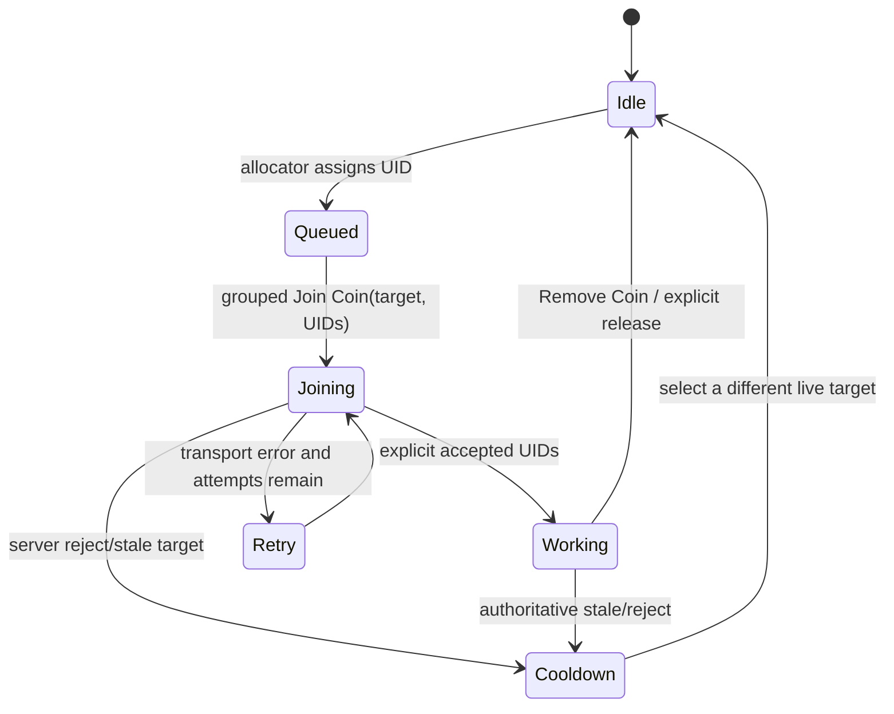

Успешный Lua-вызов, вернувший server reject, не считается transport failure. Эта монета становится локально stale/cooldown, pet сразу ищет другую живую цель. Повторять тот же reject как сетевую ошибку нельзя.

### 14.4 Accepted UID и сигналы атаки

Response Join разбирается до UID. Только явно принятые pets получают `Change Pet Target` и `Farm Coin`. Если сервер принял часть массива, остальные освобождаются/перенаправляются; нельзя считать всю группу working по одному truthy response.

### 14.5 Progress lease

Работающий pet удерживает цель, пока есть признаки жизни:

- health монеты меняется;
- membership подтверждён;
- приходит Remove Coin;
- server явно отверг target;
- bounded lease действительно истёк без progress и без живой монеты.

Watchdog локальный: он не должен превращаться в цикл сетевого `Get Coins`/Join spam.

### 14.6 Распределение при недостатке целей

Если pets больше, чем живых объектов, allocator распределяет избыток равномерно по существующим целям. Пример: 15 pets и 12 targets дают три дополнительных назначения на разные наименее загруженные targets, а не три pets на одну случайную монету и не idle ожидание.

## 15. Boss Chest fast-path

### 15.1 Почему boss mode выделен отдельно

В обычном режиме много целей живут одновременно. В Pixel Vault boss chest существует как последовательность поколений одной цели: сундук появляется, вся команда атакует, сундук удаляется, через серверный интервал появляется новый ID. Полный allocator на каждом кадре для этого не нужен.

### 15.2 Авторитетный цикл

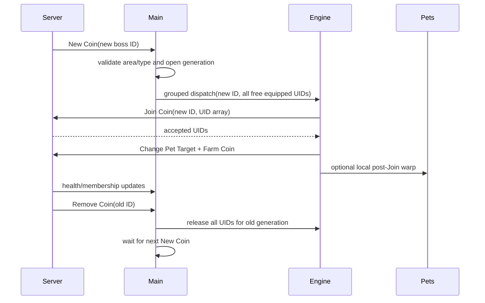

Концептуальные фазы: `ABSENT`, `SPAWN_SEEN`, `JOINING`, `WORKING`. Реализация может хранить их как поля/счётчики, но смысл должен оставаться именно таким.

### 15.3 Что запрещено между сундуками

После `Remove Coin` и до нового `New Coin` runtime не должен:

- повторять Join старого ID;
- угадывать будущий ID;
- выполнять Get Coins на каждом tick;
- сканировать весь Workspace каждый frame;
- отпускать и заново захватывать тех же pets по короткому таймеру;
- создавать несколько параллельных recovery workers.

### 15.4 Bounded recovery

Если authoritative сигнал подключён, но цель не появилась необычно долго, допускается один локальный поиск и затем ограниченный snapshot recovery. Текущая схема ждёт примерно 3.25 секунды и ограничивает fallback примерно тремя snapshot-попытками в минуту. Любой recovery заканчивается сразу после нахождения валидной цели или получения нового `New Coin`.

Это страховка от пропущенного lifecycle transition, а не обычный путь каждого respawn.

### 15.5 Direct/fallback/duplicate telemetry

Boss telemetry разделяет:

- `direct` — generation открыта непосредственно `New Coin`;
- `fallback` — цель восстановлена bounded recovery;
- `duplicate` — повторный сигнал того же ID/generation был подавлен;
- `cycles` — завершённые появления/атаки;
- `joining/working` — текущее состояние команды.

Большой рост fallback или duplicate означает проблему lifecycle, даже если визуально сундук иногда ломается.

## 16. Optional post-Join pet warp

### 16.1 Назначение

`BossPetInstantArrival` сокращает только локальное визуально-физическое возвращение pets от яйца к сундуку. Он **не заменяет** Join, не сообщает серверу выдуманный damage и не создаёт сетевых вызовов.

### 16.2 Порядок безопасности

Warp разрешён только:

1. после server-accepted Join;
2. для текущего boss generation;
3. для UIDs, которые всё ещё equipped;
4. когда найдена живая native Game.Pets table;
5. когда доступна позиция boss chest;
6. один раз на accepted batch, а не каждый frame.

### 16.3 Получение native pet records

Runtime один раз находит окружение игрового Pets LocalScript, читает `Tick` и его upvalue с native records (`uid`, physical shell, target, arrived/position-like state). Ссылки кешируются только для текущих 15–16 equipped pets.

Если equipped set изменился, cache перестраивается. Не нужен `getgc` на каждом сундуке. Если структура игры не распознана, warp fail-open отключается, а C54 grouped Join path продолжает работать.

### 16.4 Локальное перемещение

Для валидных physical shells выставляется target position и выполняется один `BulkMoveTo`/эквивалентный bounded local move всего batch. Нельзя:

- телепортировать саму coin model;
- менять Anchored/CFrame орбов;
- создавать BodyMover для каждого pet;
- повторять move каждый Heartbeat;
- считать warp доказательством server acceptance.

### 16.5 Обновление состава pets

Смена/equip/unequip пета обнаруживается сравнением компактной сигнатуры equipped UID set. При изменении:

- старые native ссылки удаляются;
- новый set ищется одним bounded pass;
- текущий farm assignment не дублируется;
- если поиск не удался, только warp становится unavailable.

## 17. Loot reactor: Orbs и Lootbags

### 17.1 Задача модуля

`loot_reactor.lua` должен выполнить две вещи одновременно:

1. гарантированно отправить ID реально появившегося loot на сбор;
2. не позволить локальным Part/Billboard/Tween/physics объектам накапливаться и съедать CPU/FPS.

### 17.2 Producer gate вместо постфактум-уборки

Лучший путь — перехватить функцию игрового LocalScript до создания визуала:

```text
Game вызывает AddOrb(id, data)
        ↓
наш gate сохраняет id
        ↓
Claim Orbs получает batch ID
        ↓
Part/Billboard/Velocity вообще не создаются
```

Для lootbag аналогично перехватывается spawn/registration point, сохраняются ID, owner/world metadata и callback подтверждения. Original function хранится для восстановления на STOP/reload.

### 17.3 Fallback policy

Если producer gate недоступен, fallback может:

- читать уже появившийся ID;
- проверить, что ID принадлежит локальному игроку/допустимому миру;
- enqueue ID;
- после безопасного подтверждения убрать локальную модель.

Fallback не должен менять `Anchored`, `CFrame`, `Velocity`, `Parent` или постоянно перепривязывать объекты. Такие манипуляции провоцируют broadphase/physics spikes и улёт мешков за карту.

### 17.4 Orb queue

Активные параметры зафиксированной версии:

| Параметр | Значение |
|---|---:|
| Минимальный batch | 8 ID |
| Максимальный batch | 32 ID |
| Максимум pending | 8192 |
| Обычный flush | около 0.65 с |
| Подтверждение | Remove/ACK или bounded timeout 2.5–8 с с учётом RTT |
| Межклиентный stagger | 16 фаз примерно по 0.01 с |

ID дедуплицируются. После Fire они перемещаются из `pending` в `unconfirmed`, а не забываются. Только inbound remove/подтверждение или безопасная retry policy закрывает record.

### 17.5 Lootbag queue

| Параметр | Значение |
|---|---:|
| Одновременные lanes | 4 |
| Максимум pending records | 4096 |
| Первая отправка | примерно через 0.05 с |
| Retry | около 0.10 с |
| Max attempts | 2 |
| Safe local destroy delay | не раньше примерно 0.15 с и после подтверждения/commit policy |
| Record pool | до 256 переиспользуемых записей |

Модель мешка нельзя удалить до того, как ID зафиксирован и отправка подтверждена по доступному протоколу. Иначе визуально мешок исчезнет, но reward не будет получен.

### 17.6 Состояния loot record

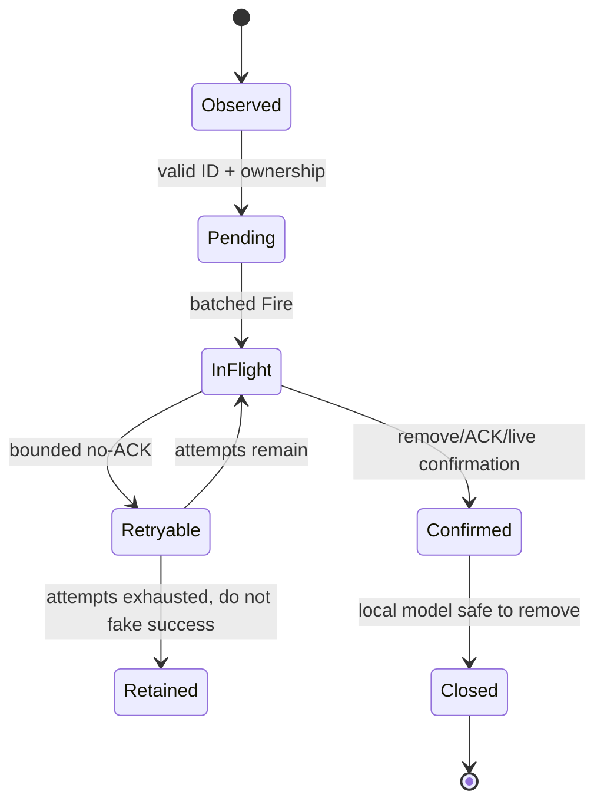

### 17.7 Почему пакеты не должны быть бесконечно большими

Один огромный пакет всех накопившихся ID кажется дешёвым, но создаёт burst, повышает стоимость сериализации, усложняет частичное подтверждение и синхронизирует десять клиентов. 8–32 — компромисс: существенно меньше calls, чем по одному ID, но bounded payload и быстрое восстановление.

### 17.8 Ownership и межклиентная нагрузка

Каждый клиент собирает собственные server-addressable IDs. Он не должен сканировать/claim чужие визуальные мешки просто потому, что они видимы рядом. UserId-based stagger снижает вероятность, что десять клиентов одновременно отправят farm+egg+loot batch в один сетевой кадр.

## 18. Auto Egg

### 18.1 Каталог яиц

Каталог строится из физических eggs, `Directory`, Save unlocks и world metadata. UI умеет показывать nearby/all подходящие eggs и выбранный scope. Перед покупкой проверяются:

- выбранное яйцо всё ещё существует;
- оно открыто/доступно игроку;
- хватает валюты;
- при x3 есть соответствующий gamepass и свободные inventory slots;
- для основной линии дистанция не превышает 15 studs;
- предыдущая покупка завершена.

### 18.2 Lifecycle покупки

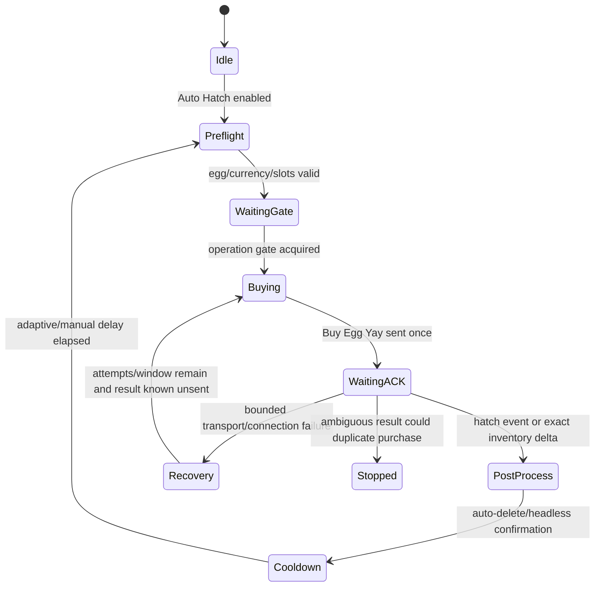

### 18.3 Подтверждение

Primary ACK — inbound `openegggg`/`Open Egg`. Compatibility confirmation — точная inventory delta подходящего возраста/egg context. Просто отсутствие ошибки из `Fire` не является hatch completion.

### 18.4 Плохой интернет и bounded recovery

За 10-минутное окно допускается до 12 попыток connection recovery с увеличивающимися интервалами примерно 1, 2, 5, 10, 20, 40, 70, 90, 110, 120, 120 секунд. Важное ограничение: recovery не создаёт overlapping purchases. Повтор допустим только когда доказано, что request не был отправлен/принят; ambiguous ACK завершает цикл безопасной остановкой.

### 18.5 Adaptive и Manual delay

- `Adaptive` оценивает историю подтверждений (bounded примерно 64 samples) и подбирает следующий cooldown под фактический серверный response.
- `Manual` использует выбранную пользователем задержку в диапазоне 0–8 секунд.
- Оба режима оставляют правило `one request in flight`.

### 18.6 Headless и Native

`Native` оставляет игровую анимацию и использует native skip path. `Headless` перехватывает producer/ack path до визуальной hatch-анимации, но сохраняет inbound событие, inventory delta и auto-delete lifecycle.

Headless не должен:

- подавлять сам ACK вместе с визуалом;
- вызывать запрещённый `require` ModuleScript из RobloxScript context;
- запускать второй Buy при медленной анимации;
- удалять pets до появления точной inventory delta.

## 19. Automation support

### 19.1 Inventory operation gate

Machines, enchant, bundle и destructive cleanup меняют один Save/inventory. Они используют единый mutex:

```text
acquire(owner, operation)
  → fresh snapshot/revalidation
  → one network operation
  → wait exact delta or timeout
  → release(owner)
```

Это не большая FIFO-очередь запросов. Если gate занят, модуль отступает и повторно проверяет своё due-состояние позже. Stale owner автоматически очищается примерно через 45 секунд, а generation change снимает gate немедленно.

### 19.2 Pixel Demon catalog

Каталог exact species строится из `Directory.Pets` и Save metadata. Он не доверяет только UI name/substring. Все Gold/Rainbow/DM и DM cleanup работают исключительно с `Pixel Demon` и fail closed при неоднозначности.

### 19.3 Enchant matcher

Matcher нормализует power names/tier и проверяет профили:

- OR между enabled rules;
- AND между conditions внутри rule;
- `Any`, `Exact`, `IV/V`, `AtLeast`;
- Teamwork compatibility union может включать Teamwork/Super Teamwork согласно условию;
- bounded result cache до примерно 2048 ключей;
- cache инвалидируется при изменении профиля/catalog.

### 19.4 Route health

Support хранит компактный локальный статус route availability. Он не отправляет probe, который может потратить валюту/пета. UI `CHECK ... ROUTES` выполняет только безопасное локальное resolution.

## 20. Машины

### 20.1 Общие инварианты

Перед каждой машиной:

1. получить/использовать свежий inventory snapshot;
2. выбрать exact Pixel Demon нужной формы;
3. исключить equipped и locked;
4. исключить pets, совпавших с protection profile;
5. исключить wrong form и pending UID другой операции;
6. сгруппировать одинаковый species/form;
7. получить/кешировать machine tier info;
8. проверить diamonds/cost/slots;
9. захватить operation gate;
10. повторно проверить выбранные UIDs;
11. отправить один batch;
12. ждать точной Save/inventory delta.

### 20.2 Gold

Вход: normal Pixel Demon. Выход: golden Pixel Demon. Свой независимый protection profile и variation list. Batch по умолчанию 6, но UI может выбирать поддерживаемый сервером tier.

### 20.3 Rainbow

Вход: golden Pixel Demon. Выход: rainbow Pixel Demon. Защита и list variations полностью независимы от Gold.

### 20.4 Dark Matter create

Вход: rainbow Pixel Demon. Модуль учитывает:

- выбранное число pets в batch;
- максимальное допустимое время;
- server `Get OSTime`;
- свободные machine slots;
- pending pet UIDs;
- отдельный DM protection profile.

### 20.5 Dark Matter claim

Claim проверяет server time и состояние slot. Он не опрашивает машину постоянно: после создания известен ожидаемый момент готовности, затем выполняется редкая проверка/claim. Claimed UID отмечаются для режима cleanup `Newly Claimed`.

### 20.6 DM Auto Delete

Destructive cleanup допускается только при одновременном выполнении всех условий:

- функция включена;
- Dry Run выключен;
- destructive confirmation включён;
- protection rules не пусты и валидны;
- pet — exact Dark Matter Pixel Demon;
- pet не equipped и не locked;
- pet входит в выбранный scope;
- pet не совпадает ни с одним protection rule;
- UID заново найден в свежем snapshot перед Delete Several Pets.

Batch bounded, default 25. Изменение scope автоматически сбрасывает confirmation.

### 20.7 Inventory snapshot policy

Snapshot кешируется примерно до 30 секунд, но помечается dirty на egg/machine/delete/inventory events. Reconcile выполняется примерно через 1.25 секунды после известного изменения. Это устраняет полный inventory scan в каждом worker tick, сохраняя fresh preflight перед mutation.

## 21. Auto Enchant

### 21.1 Поведение

Модуль выбирает один eligible equipped pet и продолжает enchant именно его, пока powers не совпадут с выбранным набором. После совпадения переходит к следующему eligible pet.

### 21.2 Ограничения

- один in-flight `Enchant Pet`;
- подтверждение только через изменение powers в Save;
- sticky UID во время попыток;
- operation gate с машинами/cleanup;
- bounded poll около 0.04 с только пока есть активная попытка;
- timeout около 8 с;
- idle/reject/backoff delays вместо busy-loop;
- при high ping/farm pressure worker уступает, а не создаёт burst.

### 21.3 Lifecycle

```text
find equipped eligible UID
→ acquire inventory gate
→ fresh powers snapshot
→ Invoke Enchant Pet once
→ wait powers delta
→ matcher success? stop this UID : repeat after bounded delay
→ release gate on stop/error/generation change
```

## 22. Boosts, Rewards и Diamond Pack

### 22.1 Boosts

Модуль читает активные timers и stock из Save. Для выбранных `Triple Coins`, `Triple Damage`, `Super Lucky`, `Ultra Lucky` он активирует новый экземпляр только внутри renewal window.

Активные интервалы порядка величины:

| Операция | Cadence/timeout |
|---|---:|
| Save refresh | около 8 с |
| Activation confirmation | до 5 с |
| Bundle recheck | около 10 с |
| Transport retry | около 8 с |
| Server reject cooldown | около 30 с |
| Idle when nothing due | около 30 с |

Bundle покупается только если хотя бы один выбранный boost имеет stock 0 и diamonds не меньше 270K. После покупки подтверждается stock/currency delta; затем обычная activation lane продолжает работу.

### 22.2 Rewards

Rewards не polling-loop каждую секунду. Main вычисляет due time по Save/native server clock:

- VIP Rewards — большой cooldown порядка 4 часов;
- Rank Rewards — по живому rank timer;
- Free Gifts — по каждому доступному gift index;
- retry после фактической ошибки bounded, а не постоянный.

`Redeem Gifts` — активная функция, не legacy и не кандидат на удаление.

### 22.3 Diamond pack

Текущий pack tier 4 стоит 12.5B Halloween Candy. Запрос разрешается только при балансе не ниже 13B, оставляя 0.5B reserve. Проверка локальная по Save/balance; пользователь выбирает интервал от 30 секунд до 5 минут. Изменение интервала переносит следующую проверку без немедленного запроса. Если threshold не достигнут, server request не отправляется.

## 23. Graphics / Potato / anti-lag

### 23.1 Цель

Graphics module уменьшает render/physics/VRAM нагрузку, не повреждая server-facing игровые данные. Он обрабатывает карту, pets, яйца, машины, Lighting и эффекты bounded очередью.

### 23.2 Очередь

| Параметр | Значение |
|---|---:|
| Максимум queued objects | 16384 |
| Максимум обработки за frame | 128 |
| Временной budget | около 0.0006 с |
| Drain connection | одна Heartbeat connection |

Один initial pass ставит объекты в очередь. После successful producer gates модуль не обязан непрерывно следить за каждым потомком Coins/Orbs: эти визуалы должны быть отсечены до создания loot reactor-ом.

### 23.3 Что можно упрощать

- Texture/Decal/SurfaceAppearance;
- ParticleEmitter/Trail/Beam/Smoke/Fire/Sparkles;
- звуки и декоративные GUI/effect containers;
- Lighting/post-processing;
- pet/egg/machine/map визуальные детали согласно выбранному режиму;
- FPS cap через доступный executor API.

### 23.4 Что нельзя повреждать

- coin ID и server records;
- native pet target shells, используемые farm;
- remotes/bridges;
- machine/egg interaction metadata;
- UI runtime;
- физические root/position данные, нужные world/zone detection;
- ownership/parent игровых сущностей без доказанной безопасности.

Potato никогда не должен телепортировать coin models или превращать loot cleanup в physics mutation loop.

## 24. Currency tracker, Quick HUD и inspector

### 24.1 Currency tracker

Tracker читает реальные balance values из `Library.Save`, а не оценивает доход по стоимости coin models или количеству орбов. Положительные delta считаются доходом, расходы учитываются отдельно, чтобы покупка яйца/машины не превращала farm rate в странное отрицательное значение.

Rolling windows поддерживают быстрый 60-second rate и более стабильные 5/10-minute/session показатели. Переход 999M → 1B — только форматирование; окно не должно обнуляться при смене суффикса.

### 24.2 Quick HUD

Компактное окно показывает:

- ping;
- текущую валюту и rolling rate;
- Auto Farm on/off, working/joining и zone;
- краткий список активных Egg/Machines/Pack/Rewards/Boosts/Loot.

Каждая строка скрывается отдельно. HUD читает уже вычисленные snapshots; он не запускает новые inventory/network scans.

### 24.3 Request inspector

Inspector пассивен. Он не hook-ает remote dispatcher, не блокирует/переставляет запросы и не является scheduler/governor. Его bounded хранилища:

| Данные | Capacity |
|---|---:|
| Events | 128 |
| Snapshots | 8 |
| Active operations | 96 |
| Ping samples | 120 |

UI обновляется примерно каждые 0.5 с в развёрнутом виде и около 5 с в свёрнутом. Кнопка Snap только фиксирует bounded diagnostic snapshot и не должна останавливать farm.

### 24.4 Incidents

Типичные диагностические incidents:

- `ROUTE_UNRESOLVED` — логический route не найден;
- `PRODUCER_COLD` — producer gate ещё не готов;
- `CLIENT_SCHEDULER_STALL` — main scheduler задержался;
- `STARTUP_REQUEST_BURST` — много операций совпали во startup window;
- transport timeout/reject spikes;
- farm liveness stalled;
- loot retention/backlog overflow.

Incident — наблюдение, не автоматическое разрешение менять gameplay policy.

## 25. Фоновые задачи и частоты

Ниже карта intended cadence. Точные внутренние задержки могут корректироваться, но назначение каждого цикла должно сохраняться.

| Подсистема | Trigger | Когда активна | Сеть |
|---|---|---|---|
| Coin catalog | New/Update/Remove Coin | Всегда после farm init | Нет |
| Initial coin snapshot | Farm start/world change/recovery | Bounded | Get Coins function |
| Allocator | dirty/free UID/new target | Auto Farm | Нет |
| Farm dispatch | готовый assignment batch | Auto Farm | Join + accepted target/farm events |
| Boss recovery | нет цели после bounded deadline | Boss mode | Max ~3 snapshot/min |
| Pet warp | accepted boss batch | Optional | Нет |
| Orb flush | pending ≥8 или ~0.65s deadline | Collect Orbs | Claim Orbs batch |
| Lootbag worker | новый local-owned bag | Collect Lootbags | Collect Lootbag |
| Egg controller | предыдущий lifecycle завершён | Auto Hatch | Один Buy |
| Inventory reconcile | dirty event + ~1.25s settle | Machines/egg/delete | Обычно нет, Save read |
| Gold/Rainbow | достаточно eligible pets | Toggle on | Info/use только due |
| DM create/claim | batch/slot ready time | Toggle on | Due only |
| DM cleanup | новый claimed/all scope change | Cleanup enabled | Delete only after guards |
| Auto Enchant | active UID не совпал | Toggle on | Один Invoke за попытку |
| Boost refresh | примерно 8–30s по состоянию | Selected boosts | Только renewal/zero stock |
| Rewards | computed due time | Toggle on | Только due |
| Diamond pack | threshold, выбранные 30–300s | Toggle on | Только threshold |
| Graphics drain | queued visual work | Potato/settings change | Нет |
| Main telemetry | 1s cheap publish | UI runtime | Нет |
| Heavy diagnostic sample | 0.5s visible / 5s hidden | Monitor/HUD/inspector | Нет |

Главный критерий: worker, у которого ничего не due, должен спать или ждать события. Он не должен продолжать сканировать inventory/remotes с высокой частотой.

## 26. Fail-closed/fallback матрица

| Сбой | Нормальная реакция | Чего не делать |
|---|---|---|
| Не найден Network route | Status unavailable, exact cache invalidate, bounded later resolution | Не подставлять случайный remote |
| Join server reject | Target cooldown/stale, сразу другая живая цель | Не retry тот же ID как transport error |
| Join transport error | До 2 attempts с delay | Не бесконечный Join loop |
| Пропущен boss event | Один local check, bounded snapshot recovery | Не Get Coins каждый tick |
| Не найден native Pets table | Warp disabled, C54 path продолжает работать | Не останавливать farm |
| Orb producer unavailable | Read-only ID fallback | Не двигать/anchor/reparent орбы |
| Lootbag ACK неясен | Retain record/model, bounded retry | Не удалять модель до reward |
| Hatch ACK неясен | Остановить/ждать recovery window | Не покупать повторно вслепую |
| Machine catalog неясен | Ничего не craft/delete | Не использовать substring имени |
| Inventory gate занят | Отступить и проверить позже | Не создавать глобальную FIFO пробку |
| Machine result неясен | Pending UID + fresh inventory reconcile | Не отправлять тот же batch снова |
| DM protection empty/invalid | Cleanup blocked | Не считать «нет rules» разрешением удалить всё |
| Generation изменилась | Callback немедленно выходит | Не завершать действие старого runtime |
| UI/inspector скрыт | Редкая/нулевая перерисовка | Не пересобирать весь текст каждый frame |

## 27. Производительные инварианты

### 27.1 Что делает текущую версию лёгкой

- Coin model строится один раз и обновляется событиями.
- Boss mode отправляет pets grouped batch, а не 16 независимых Join.
- Farm route cache разрешается один раз и инвалидируется точечно.
- Орбы собираются batches 8–32.
- Loot records переиспользуются из pool.
- Inventory snapshot shared и dirty-driven.
- Machines/boosts/rewards запускаются только when due.
- Producer gates предотвращают визуальную физику до `Instance.new`/`Clone`.
- Inspector bounded и пассивен.
- Graphics имеет frame budget.
- Reload чистит connections/workers/gates.

### 27.2 Запрещённые anti-patterns

Любой из следующих паттернов требует отдельного review:

1. `while task.wait()` на высокой частоте в каждом модуле.
2. `getgc()`/`getconnections()`/полный `GetDescendants()` внутри farm/loot tick.
3. Несколько модулей, независимо сканирующих Save inventory.
4. Глобальная priority queue, через которую обязаны проходить farm, egg, machines и rewards.
5. Повтор любого mutation request без доказанного transport failure.
6. Переопределение `Library.Network` целиком.
7. Cache remote без kind/command/generation validation.
8. Удаление loot model сразу после локального Fire.
9. Teleport/reparent монет или орбов ради «ускорения».
10. UI text rebuild каждый Heartbeat.
11. Небounded history/temporary tables в telemetry.
12. Старый worker, который не проверяет runtime token.

### 27.3 Почему ping может расти со временем

При ревизии в первую очередь проверить:

- pending/unconfirmed loot, которые не закрываются и повторяются;
- rejected target, ошибочно попавший в transport retry;
- несколько generation workers после reload;
- stale inventory gate owner;
- machine pending UID без reconciliation;
- missing ACK яйца, создающий recovery attempts;
- route invalidation всей карты вместо exact route;
- совпадение startup phases десяти клиентов;
- полную диагностику/логирование без bounded buffer;
- boss recovery, ставший обычным polling path.

Сам по себе высокий ping не доказывает, что виноват один тип request. Нужна корреляция с route counters, pending depths и server lifecycle.

## 28. Observed baseline C54.4

Один из контрольных snapshots зафиксировал следующий успешный профиль:

| Метрика | Наблюдение |
|---|---:|
| Join batches | 50 |
| Accepted pets | 800 (по 16) |
| Reject/retry/error/stale | 0/0/0/0 |
| Boss cycles | 49 |
| Warp batches/pets | 49/784 |
| Warp skipped/errors | 0/0 |
| Orb ACK | 11854 |
| Orb drops/errors | 0/0 |
| Lootbags committed | 216 |
| Incident | none |
| Ping | около 229 ms |
| Scheduler delay | около 10 ms |

Это **наблюдение конкретной сессии**, а не обещание производительности. Оно полезно как smoke baseline: новый patch не должен превращать grouped 16 accepted в 16 отдельных requests, увеличивать fallback при нормальном `New Coin` или создавать loot backlog.

## 29. Test matrix

### 29.1 Manifest/build/generation

| Тест | Что защищает |
|---|---|
| `tests/runtime_manifest_test.js` | Полнота manifest и identities |
| `tests/generation_cleanup_test.js` | Старые callbacks/workers не переживают reload |
| `tests/request_state_inspector_policy_test.js` | Inspector остаётся bounded/passive |

### 29.2 Network transport

| Тест | Что защищает |
|---|---|
| `tests/network4_transport_test.lua` | Resolver/API на Luau fixtures |
| `tests/network4_transport_policy_test.js` | Route class/validation/fallback policy |
| `tests/network4_ping_stability_test.js` | Нет опасного fan-out/re-resolution |

### 29.3 Farm/boss/world fixes

| Тест | Что защищает |
|---|---|
| `tests/pet_farm_engine_policy_test.lua` | Queue/Join/retry/UID lifecycle |
| `tests/native_pet_coin_contract_test.js` | Native pet/coin event contract |
| `tests/farm_progress_lease_test.js` | Pet не бросает живую цель |
| `tests/boss_chest_presence_gate_test.js` | Join только при существующем boss |
| `tests/boss_dispatch_liveness_test.js` | Boss path не замирает |
| `tests/boss_fast_path_lifecycle_test.lua` | New/Join/Remove generation lifecycle |
| `tests/hacker_portal_hotfix_test.js` | Hacker Portal compatibility |
| `tests/axolotl_ocean_hotfix_test.js` | Axolotl chest respawn handling |
| `tests/pixel_vault_minimal_refresh_test.js` | Pixel Vault event-driven path |

### 29.4 Loot/currency

| Тест | Что защищает |
|---|---|
| `tests/zero_retention_reactor_test.js` | Producer-gated no-retention invariants |
| `tests/coalesced_queue_test.js` | Bounded batch/coalescing |
| `tests/coin_catalog_fail_open_test.js` | Snapshot failure не убивает valid event farm |
| `tests/rolling_currency_window_test.js` | 60s/5m rate и форматирование |

### 29.5 Eggs

| Тест | Что защищает |
|---|---|
| `tests/auto_egg_network_retry_test.js` | 10-minute bounded recovery без overlap |
| `tests/auto_egg_headless_producer_gate_test.js` | Headless ACK сохраняется, visuals подавляются |
| `tests/auto_egg_manual_concurrency_test.js` | Manual/native click не создаёт duplicate purchase |

### 29.6 Machines/enchant/automation

| Тест | Что защищает |
|---|---|
| `tests/automation_support_catalog_test.lua` | Exact Pixel Demon catalog и normalization |
| `tests/automation_ui_status_test.lua` | Status/UI contract |
| `tests/machine_sparse_directory_test.lua` | Fail closed при неполном Directory |
| `tests/machine_404_enchant_policy_test.lua` | Историческая machine/protection regression |
| `tests/develop_404_hud_policy_test.js` | Историческая develop/HUD regression |
| `tests/develop_prompt10_policy_test.js` | Комплексные machine/farm invariants прошлого update |
| `tests/dark_matter_policy_test.lua` | DM create/claim safety |
| `tests/dark_matter_cleanup_policy_test.lua` | Scope/dry-run/confirm/protection deletion guards |
| `tests/enchant_rule_matcher_test.lua` | OR/AND и tier matching |
| `tests/auto_enchant_policy_test.lua` | Enchant selection/backoff |
| `tests/auto_enchant_worker_test.lua` | Один in-flight/sticky UID |
| `tests/auto_enchant_integration_test.js` | Main/UI/module integration |

### 29.7 Rewards/boost/update policies

| Тест | Что защищает |
|---|---|
| `tests/autogifts_rainbow_pack_policy_test.js` | Gifts и Rainbow pack threshold |
| `tests/reward_clock_hotfix_test.js` | Server timing/due behavior |

Примечание: некоторые тесты сохраняют исторические названия (`404`), но проверяемая текущая production species — Pixel Demon. Название теста само по себе не делает старого пета активным.

## 30. Release gate

### 30.1 Минимальный обязательный pipeline

```powershell
node build_slim.js

powershell -ExecutionPolicy Bypass -File `
  C:\Users\destr\.codex\skills\roblox-luau-crash-safe-release\scripts\check_release.ps1 `
  -Root C:\Users\destr\Documents\Codex\2026-07-17\new-chat\toolofmind-c54-pet-warp `
  -Entry slim_farm.lua `
  -Generated toolofmind.lua `
  -Loader loader.lua
```

Gate должен проверить:

- manifest/build consistency;
- официальный Luau compile для main, всех active modules и обоих artifacts;
- JS/Luau policy tests;
- source/artifact parity;
- static preflight на instant-crash риски;
- отсутствие неожиданного diff generated files.

### 30.2 Что gate не доказывает

Статический/fixture gate не доказывает:

- доступность живого Network4 map конкретного server build;
- реальную server economy/cost;
- поведение executor-specific `getsenv/getgc/setfpscap`;
- multi-client ping;
- серверный ACK покупок/машин;
- фактический FPS/physics profile.

Эти свойства проверяются runtime smoke test и snapshot/MicroProfiler, но только после compile/test gate.

## 31. Практический сценарий выпуска изменения

### 31.1 Изменение main

1. Править `slim_farm.lua`.
2. Обновить suite/manifest только если это релизная версия, а не незавершённый локальный patch.
3. Убедиться, что новый worker имеет generation guard и cleanup.
4. Запустить canonical build.
5. Прогнать release gate.
6. Посмотреть diff source + artifacts + manifest.
7. Создать rollback tag до публикации.

### 31.2 Изменение активного модуля

1. Править module source.
2. Обновить его `MODULE_VERSION`, если изменился публичный contract.
3. Commit module source.
4. В manifest обновить module commit, bytes/SHA256/DJB2 и compatible suite.
5. Обновить main context только при реальном API change.
6. Build + tests + Luau compile.
7. Проверить, что старый artifact больше не загружает предыдущий blob.

Manifest pin означает, что незакоммиченный изменённый module намеренно не соберётся как production.

### 31.3 Добавление нового route

1. Зафиксировать logical command, kind и реальные arguments из авторитетного источника.
2. Добавить route в тематический manifest/docs.
3. Использовать existing Network transport API, не новый hash resolver.
4. Определить ACK/confirmation до написания retry.
5. Определить destructive/replay policy.
6. Добавить fixture/policy test.
7. Проверить route unavailable path: функция должна fail closed.

### 31.4 Добавление нового мира/зоны

1. Добавить world/zone aliases и нормализацию area.
2. Проверить initial snapshot и named events.
3. Для boss определить надёжный `New Coin` classification.
4. Не копировать отдельный farm engine.
5. Добавить world-specific regression test.

### 31.5 Добавление новой машины/пета

1. Расширить exact catalog, не substring.
2. Описать входную/выходную form.
3. Создать отдельный protection profile.
4. Использовать общий operation gate и snapshot.
5. Реализовать confirmation по inventory delta.
6. Для удаления добавить dry-run/confirm/scope/equipped/locked guards.

### 31.6 Изменение loot

1. Сначала определить producer и ACK.
2. Сохранять ID до подавления визуала.
3. Отделять `pending`, `in-flight`, `unconfirmed`, `confirmed`.
4. Ограничить queue/pool/history.
5. Никогда не считать Fire server ACK.
6. Проверить STOP restoration producer function.

## 32. Runtime smoke test

### 32.1 Один клиент

1. Запустить на чистой Roblox-сессии.
2. Убедиться, что startup завершён без module/version/hash ошибок.
3. Включить farm в выбранной зоне.
4. Проверить 15/15 или 16/16 working, queue → 0.
5. Проверить boss 10+ циклов: direct растёт, fallback около 0, duplicate bounded.
6. Проверить Orbs/Lootbags: pending возвращается к 0, ACK растёт, models не остаются.
7. Включить egg: один in-flight, подтверждения растут, headless без visuals.
8. По отдельности включить Gold/Rainbow/DM/boost/rewards.
9. Проверить operation gate не зависает и farm не ждёт automation.
10. Выполнить reload без перезахода: generation меняется, старые workers исчезают.

### 32.2 Десять клиентов

Тестировать только после single-client stability:

- запускать клиентов с их deterministic phase;
- фиксировать base/p50/p95/max ping;
- сравнивать grouped Join count с boss cycles;
- смотреть orb batch size/calls, loot pending и no-ACK;
- проверять farm/min не только первые 60 секунд, но 15 минут и 6 часов;
- убедиться, что machines/boost/rewards продолжают выполнять due операции;
- проверить CPU/RAM каждого процесса, а не только aggregate Task Manager.

Не делать вывод по одному всплеску. Критична деградация trend: растущие pending/retry/generation workers вместе с падением farm rate.

## 33. Диагностическая развилка «фарм остановился»

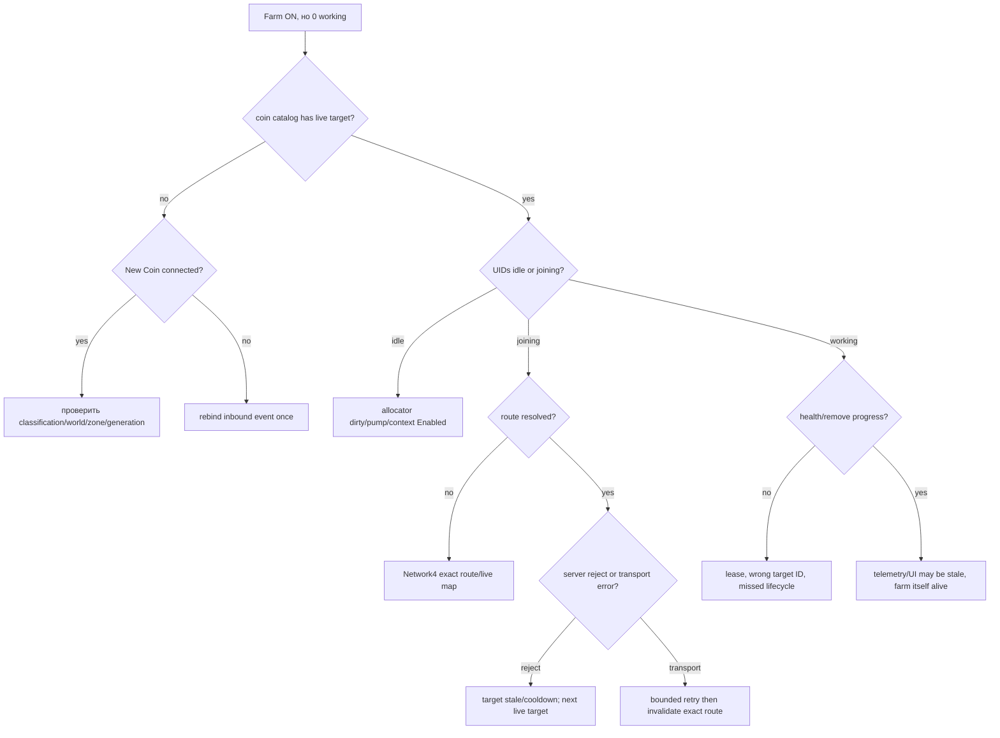

Проверять в таком порядке выгоднее, чем сразу добавлять новый Get Coins loop.

## 34. Диагностическая развилка «loot виден, но не собирается»

1. Producer gate активен или fallback?
2. Реальный ID попал в pending?
3. Ownership/world validation пропустила ID?
4. Route `Claim Orbs`/`Collect Lootbag` resolved?
5. Record перешёл в in-flight/unconfirmed?
6. Пришёл inbound remove/ACK?
7. Модель удалена только после confirmation?
8. Нет ли queue overflow или record eviction?
9. Не восстановил ли старый generation original producer поверх нового?

Если модель исчезла до пунктов 4–6, это data-loss bug. Если model остаётся после confirmed — это local cleanup bug. Эти случаи нельзя смешивать.

## 35. Диагностическая развилка «ping растёт»

Снять одновременно:

- ping p50/p95/max и base;
- farm Join/target/farm calls за минуту;
- boss direct/fallback/duplicate;
- orb calls и средний batch;
- lootbag calls/ACK/no-ACK;
- egg request/ACK/retry/overlap;
- machine/boost/reward due calls;
- active generation и worker counts;
- scheduler delay;
- pending/unconfirmed depth.

Интерпретация:

| Наблюдение | Вероятная причина |
|---|---|
| Ping растёт вместе с Join reject/retry | stale target принят за transport fail |
| Ping растёт, orb calls много, batch мал | flush/dedupe regression |
| Ping растёт со временем, pending тоже | ACK/retention leak |
| Ping скачет при startup 10 клиентов | phase/fan-out collision |
| Ping растёт при машинах, gate занят | повтор inventory mutation/reconcile loop |
| Ping нормальный, FPS падает | local physics/render/diagnostic CPU, не network |
| Farm rate падает, requests не растут | target lifecycle/lease/position/boost state |

## 36. Как читать проект с нуля

Рекомендуемый порядок:

1. Прочитать разделы 1–4 этой карты.
2. Открыть `runtime_manifest.json` и найти активный module order.
3. Прочитать верх/инициализацию и shutdown `slim_farm.lua`.
4. Прочитать `network4_transport_module.lua` и `NETWORK4_ROUTE_MANIFEST.md`.
5. Найти coin event handlers/allocator/context farm engine в `slim_farm.lua`.
6. Прочитать `pet_farm_lite_engine.lua`.
7. Прочитать `loot_reactor.lua` как отдельный event-driven pipeline.
8. Прочитать `automation_support_module.lua`, затем machine/enchant/boost modules.
9. Прочитать `auto_egg_module.lua` и его ACK/recovery state.
10. Прочитать `automation_ui_module.lua`, когда уже понятны модели данных.
11. Прочитать `build_slim.js` и release tests перед первой правкой.

Не начинать с generated `toolofmind.lua`: там те же модули встроены и compacted, поэтому связи увидеть сложнее.

## 37. Глоссарий

| Термин | Значение в проекте |
|---|---|
| Artifact | Собранный `toolofmind.lua`/`loader.lua` |
| Composition root | `slim_farm.lua`, место сборки всех зависимостей |
| Generation | Номер конкретного execute в текущей Roblox-сессии |
| Token | Уникальный ownership-маркер работающего runtime |
| Logical command | Читаемое имя команды, например `Join Coin` |
| Hashed route | Живой remote с session-specific именем |
| Bridge | Внутренний Bindable/dispatcher путь Library.Network |
| ACK | Доказательство серверного результата, не просто успешный Fire |
| Producer gate | Перехват ID до создания локального visual/physics объекта |
| Coin catalog | Нормализованная event-driven таблица живых targets |
| Allocator | Выбор target для свободного pet UID |
| Dispatch lane | Ограниченный исполнитель grouped Join/attack |
| Lease | Срок доверия текущему assignment, продлеваемый progress |
| Boss generation | Один жизненный цикл конкретного boss coin ID |
| Operation gate | Mutex для inventory mutation, не глобальная request queue |
| Protection rule | Условие, по которому pet нельзя craft/delete |
| Fail closed | При неясности ничего не отправлять/не удалять |
| Fail open | Необязательная оптимизация отключается, основная функция продолжает безопасный путь |
| Pending UID | Pet, участвующий в ещё не подтверждённой mutation |
| Dirty snapshot | Кеш inventory, который нужно обновить перед mutation |
| Bounded | Имеет явный лимит размера, времени или attempts |

## 38. Краткая карта ответственности для сопровождения

| Если нужно изменить… | Основной файл | Обязательная соседняя проверка |
|---|---|---|
| Startup/reload/config/main UI | `slim_farm.lua` | generation cleanup + manifest/build |
| Hashed remotes | `network4_transport_module.lua` | route manifest + transport tests |
| Farm queue/Join/retry | `pet_farm_lite_engine.lua` | main allocator + boss tests |
| World/zone/coin events | `slim_farm.lua` | world hotfix tests |
| Orbs/Lootbags | `loot_reactor.lua` | zero retention + coalesced queue |
| Eggs/headless/recovery | `auto_egg_module.lua` | three egg tests |
| Inventory mutex/catalog/rules | `automation_support_module.lua` | catalog/rule tests |
| UI rules/machines | `automation_ui_module.lua` | UI status + integration |
| Gold | `gold_machine_module.lua` | exact catalog/protection |
| Rainbow | `rainbow_machine_module.lua` | exact catalog/protection |
| DM create/claim/delete | `dark_matter_module.lua` | DM policy + cleanup policy |
| Equipped enchant | `enchant_module.lua` | worker/policy/integration tests |
| Boost/bundle | `boost_module.lua` | Save confirmation/route availability |
| Potato/FPS | `graphics_module.lua` | loot producer ownership + MicroProfiler |
| Inspector | `request_state_inspector.lua` | passive/bounded policy |
| Build/module pins | `runtime_manifest.json`, `build_slim.js` | full release gate |

## 39. Неприкосновенные границы текущего rescue baseline

Чтобы не повторить прежние регрессии, следующие свойства считаются частью рабочего C54.4 baseline:

- 16-wide grouped farm path;
- reject и transport error разделены;
- boss живёт по `New Coin`/`Remove Coin`, а recovery bounded;
- optional warp никогда не является условием работы farm;
- loot Fire не считается ACK;
- orb batch bounded 8–32;
- машины не проходят через farm/loot scheduler;
- operation gate не превращён в общую очередь всех requests;
- inventory snapshot общий и dirty-driven;
- automation работает only-due;
- inspector пассивен;
- generated artifacts строятся только canonical builder;
- STOP/reload удаляет старое поколение.

Изменение любой границы требует отдельного теста и сравнения с контрольной точкой, а не включения в большой смешанный patch.

## 40. Итоговая схема

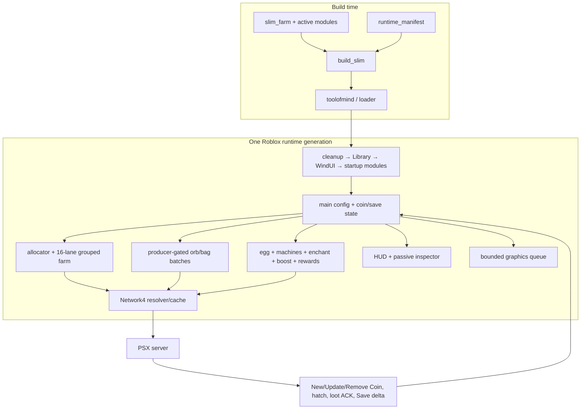

В одной фразе: **main хранит правду о текущей сессии, Network4 доставляет логические команды, farm/loot реагируют на события с bounded очередями, automation меняет inventory только when due под общим mutex, а manifest/build/generation не дают незаметно смешать версии или оставить старый runtime живым.**
