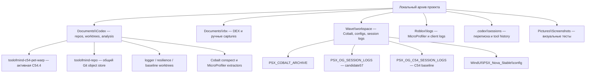
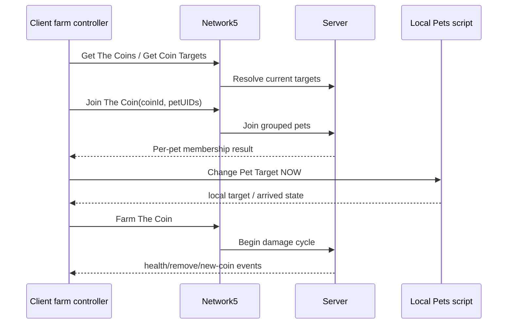

# PSX OG Nova Develop — полный архив знаний, наблюдений и внешних материалов

> Этот документ дополняет `PROJECT_ARCHITECTURE_MAP.md`. Архитектурная карта объясняет **активный код**. Этот справочник объясняет, **откуда взялись решения**, где на компьютере лежат исходные наблюдения, какие версии были контрольными, чем подтверждены выводы и какие гипотезы ещё нельзя считать доказанными.
>
> Зафиксированная точка: ветка `candidate/c54-core-rescue-20260814`, Git HEAD `3a54e96e69929e99435448d0858d5ad0548f22a9`, suite `1.4.1-candidate.54.4-core-rescue`.

## 1. Зачем нужен отдельный архив знаний

Проект развивался не только через файлы текущего репозитория. Решения принимались на основании:

- DEX/decompiled-файлов и ручных network captures;
- Cobalt-снимков исходящих и входящих вызовов;
- MicroProfiler HTML-дампов;
- многоклиентных JSONL session-логов;
- скриншотов телеметрии, UI и ошибок;
- длинной Codex-переписки с последовательными тестами;
- Git checkpoints, rollback tags, candidate/develop/lowonline/thin веток;
- фактических наблюдений на 1–10 клиентах.

Если читать только текущий `slim_farm.lua`, легко повторить уже пройденные ошибки: вернуть глобальную очередь, принять отсутствие boss chest за смерть farm, начать retry rejected coin как transport error, удалить loot до подтверждения или подавить producer вместе с игровыми данными.

Этот документ решает четыре задачи:

1. показывает все найденные project-related директории;
2. отделяет активный source от исторического evidence;
3. связывает наблюдения с конкретными дампами/логами/тегами;
4. фиксирует, какие выводы подтверждены, а какие пока являются гипотезами.

## 2. Граница аудита и защита приватных данных

Проверены только каталоги, которые непосредственно использовались при разработке PSX OG:

```text
C:\Users\destr\Documents\Codex
C:\Users\destr\Documents\rbx
C:\Users\destr\AppData\Local\Wave\workspace
C:\Users\destr\AppData\Local\Roblox\logs
C:\Users\destr\.codex\sessions
C:\Users\destr\.codex\archived_sessions
C:\Users\destr\Pictures\Screenshots
```

Не включались в индекс:

- нерелевантные личные файлы;
- proxy/Sing-box credentials и ранее присланные proxy secrets;
- содержимое аккаунтов, cookies, browser profiles и executor credentials;
- гигантские сырые дампы целиком;
- повторяющиеся subagent/guardian transcripts, если они не содержат отдельного решения.

Документ хранит пути, размеры, роли и выводы. Он не копирует секреты и не превращает репозиторий в архив на десятки гигабайт.

## 3. Иерархия доверия к материалам

| Уровень | Источник | Что он доказывает | Ограничение |
|---:|---|---|---|
| A | Активный manifest/source/build/tests | Что реально входит в C54.4 и какие инварианты статически проверены | Не доказывает live server behavior |
| B | Cobalt call/path/decompiled snapshots | Реальные logical commands, payload shape, client sequence и Network5 hashing | Capture зависит от того, какие действия были выполнены |
| C | Session JSONL logger | Динамику join/orb/loot/egg/ping/FPS конкретной сессии | Нельзя напрямую сравнивать разные server conditions |
| D | Roblox MicroProfiler | Клиентские CPU/jobs/network ingress/render/physics spikes | Не показывает внутреннюю очередь сервера и не всегда даёт logical route name |
| E | Скриншот + точное пользовательское описание | Фактический симптом, UI state и контекст теста | Один кадр не даёт причинность |
| F | DEX/reference `.txt` | Возможные нативные функции, старые remotes и client flow | Имена/индексы/структуры могли устареть |
| G | Гипотеза из обсуждения | Направление следующего теста | Не использовать как production fact без подтверждения |

Правило: при конфликте активный code/manifest определяет текущую реализацию, а Cobalt/live logs определяют реальный протокол. Старый DEX не имеет права переопределять свежий capture.

## 4. Главная карта локальных хранилищ



Сводка на момент аудита:

| Корень | Файлов | Объём | Назначение |
|---|---:|---:|---|
| `C:\Users\destr\Documents\Codex` | 877 | ~0.60 GiB | Репозитории, worktrees, analysis scripts и derived profiler data |
| `C:\Users\destr\Documents\rbx` | 105 | ~5.3 MiB | DEX/reference captures для farm/eggs/machines/loot/rewards |
| `C:\Users\destr\AppData\Local\Wave\workspace` | 1,624 | ~0.12 GiB | Cobalt archive, runtime configs, session logs |
| `C:\Users\destr\AppData\Local\Roblox\logs` | 230 | ~1.36 GiB | Roblox logs; из них 28 MicroProfiler HTML на ~1.35 GiB |
| `C:\Users\destr\.codex` | 7,787 | ~16.61 GiB | Основная переписка, subagent traces, state/cache |
| `C:\Users\destr\Pictures\Screenshots` в окне 17.07–14.08 | 847 | ~126.5 MiB | Визуальные тесты, ошибки, телеметрия и multi-client раскладки |

## 5. Git, репозитории и worktrees

### 5.1 Общий Git root

Главный repository worktree:

```text
C:\Users\destr\Documents\Codex\2026-07-17\new-chat\toolofmind-repo
```

Remote:

```text
https://github.com/destr0f/toolofmind.git
```

Этот worktree сейчас стоит на `candidate/event-boss-enchant-rules-20260814`. Он хранит общий Git object database и не является активной C54.4 точкой документации.

### 5.2 Найденные worktrees

| Путь | Ветка/состояние | HEAD | Роль |
|---|---|---|---|
| `...\toolofmind-repo` | `candidate/event-boss-enchant-rules-20260814` | `0b070e3` | Основной Git worktree, candidate57 experiments |
| `...\.codex-baseline-dev31` | detached | `36fc4f2` | Baseline до request inspector |
| `...\toolofmind-c54-logger` | `candidate/54-passive-logger-20260814` | `bc64cc3` | C54 + observer-only session logger |
| `...\toolofmind-c54-resilience` | `candidate/c54-resilience-20260814` | `0dce8b5` | C54.1 rearm/resilience |
| `...\toolofmind-c54-pet-warp` | `candidate/c54-core-rescue-20260814` | `3a54e96` | Активная C54.4 core rescue и эта документация |

Важно: эти папки не являются независимыми копиями истории. Это Git worktrees одного repository. Нельзя рекурсивно удалять один из них как «старую папку» без `git worktree list` и понимания привязанной ветки.

### 5.3 Семантика основных веток

| Ветка | Смысл |
|---|---|
| `main` | Историческая публичная база |
| `stable` | Историческая stable-линия |
| `develop` | Основная линия до Network4/C54 экспериментов |
| `candidate/*` | Изолированные исправления, сравнения и rollback-safe releases |
| `lowonline` | Отдельная игра/ранний progression; нельзя смешивать configs/remotes с основной линией |
| `thin` | Эксперимент полного eco runtime; был внедрён, отменён и позже восстановлен отдельно |
| `alpha-testing` | Ранние speed/farm experiments |
| `diagnostic-profiler` | Историческая diagnostic baseline-линия |
| `checkpoint/*` | Ручные точки перед рискованными farm/producer-gate изменениями |

### 5.4 Ключевые контрольные версии

| Commit/tag | Почему важен |
|---|---|
| `6d81e92d` / `rollback-pixel-vault-base-6d81e92d` | Пользовательская «самая рабочая» минимальная база до серии сложных governors |
| `919550c` / `rollback-c54-before-resilience-20260814` | C54 с рабочими Network5 machine routes; использовался как baseline для пассивного логгера |
| `bc64cc3` | Та же логика C54 + observer-only JSONL logger |
| `0dce8b5` | C54.1 missed boss dispatch rearm |
| `824e86f` | C54.2 bounded pet warp |
| `8efe31a` | C54.3 generation-terminal/headless-safe boss dispatch |
| `3a54e96` / `candidate-c54.4-core-rescue-20260814` | Активная точка: восстановлен boss lifecycle и post-join warp |

### 5.5 Исторические rollback-семейства

Полный список всегда получать через:

```powershell
git tag --sort=-creatordate
git log --all --date=short --decorate --oneline
```

Практически важные семейства:

- `rollback-before-event-boss-rules-*` — до конструктора enchant rules и нового boss path;
- `rollback-before-network4-ping-stability-*` — до Network4 smoothing/fanout patches;
- `rollback-before-thin-*` — до thin/eco rewrites;
- `rollback-before-network4-native-bridge-*` — до native bridge farm;
- `rollback-before-egg-*` — до successive Open Eggs ACK/gate changes;
- `rollback-total-request-diet-*`, `rollback-cpu-diet-*`, `rollback-request-lane-governor-*` — точки перед governors, которые могли душить machines/rewards/farm;
- `candidate-dev3x/dev4x-*` — последовательные liveness/loot/Network4 hotfix checkpoints;
- `develop-pre-*` — старые safety points перед Hacker Portal, Axolotl, enchant, producer gate и network governor;
- `lowonline-pre-*` — полностью отдельная линия lowonline.

## 6. Репозиторий анализа `new-chat`

Корень:

```text
C:\Users\destr\Documents\Codex\2026-07-17\new-chat
```

Кроме Git worktrees здесь лежат инструменты и derived evidence:

| Файл/папка | Роль |
|---|---|
| `PSX_COBALT_NETWORK_CONSPECT_20260813.md` | Самый полный локальный конспект Network5 и нативного client flow |
| `Cobalt.latest.luau` | Сохранённая версия Cobalt; reference, не active dependency runtime |
| `cobalt_archive_plugin.luau` | Архиватор Cobalt calls/origin/decompiled/function info |
| `cobalt_decompile_grabber.lua` | Ранний grabber decompiled views |
| `cobalt_plus_archiver_loader.lua` | Loader Cobalt + archiver |
| `cobalt_ui_archiver.lua` | Ранний UI snapshot collector |
| `route_scout_scratch.lua` | Первый route scout prototype |
| `route_scout_v02.lua` | Улучшенный route scanner; historical diagnostic |
| `get_ostime_remote.lua` | Probe точного server time route |
| `psx_ping_404_demon_probe.lua` | Старый ping/species probe |
| `temp_lua_limit_check.py` | Проверка Luau locals/register-limit regression |
| `mp_cdp_extract.js`, `mp_cdp_deep.js` | Извлечение данных из MicroProfiler HTML |
| `mp_*_summary.json`, `mp_*_deep.json` | Derived profiler aggregates; не оригинал |
| `work\` | Большие временные raw/generated profiler artifacts |

### 6.1 Тяжёлые временные profiler-артефакты

Папка `...\new-chat\work` содержит, среди прочего:

- `microprofile-20260801-010925.html.raw` — ~487 MB;
- `microprofile-20260803-114807.html.raw` — ~110 MB;
- generated JS, filtered summaries, folded flamegraph и parser scripts.

Это derived cache. Оригинальные HTML лежат в Roblox logs. При нехватке места сначала можно пересоздать derived cache из оригиналов, но удаление не выполнять без отдельной проверки.

## 7. DEX и ручные captures в `Documents\rbx`

Корень:

```text
C:\Users\destr\Documents\rbx
```

Состав: 105 файлов, из них 102 `.txt` и 3 `.lua`, около 5.3 MB.

### 7.1 Структура

| Папка | Файлов | Объём | Назначение |
|---|---:|---:|---|
| `Documents\rbx` | 60 | ~4.54 MB | Основная игра: remotes, eggs, machines, rewards, loot, checks |
| `Documents\rbx\fix1` | 22 | ~0.39 MB | Captures после смены сетевого слоя; farm/orbs/Network4 investigation |
| `Documents\rbx\lowonline` | 23 | ~0.38 MB | Отдельная lowonline игра и её progression/remotes |

### 7.2 Группы файлов

| Группа | Файлы | Что из них извлекалось |
|---|---|---|
| Initial farm/remotes | `11.txt`, `13.txt`, `104.txt`, `new17.txt`, `new19.txt`, `new110.txt`, `UPDATEDREMOTE19/21/74.txt`, `ONCLIENT6/7/8/138/144.txt` | Join/Farm/target events, client callbacks и старые route shapes |
| Gold machine | `GOLDM1.txt`–`GOLDM3.txt` | Machine info/use payload и chance/batch behavior |
| Rainbow machine | `RBM1.txt`, `RBM2.txt` | Golden input, rainbow use/info flow |
| Dark Matter | `DMM1.txt`, `DMM2.txt` | Create/claim/server time patterns |
| Eggs | `AUTOEGG1.txt`–`AUTOEGG5.txt` | Buy/Open/skip/animation/auto-delete client flow; `AUTOEGG4` особенно большой |
| Develop eggs | `developeggs1.txt`–`developeggs5.txt` | Повторный capture после game/network update; `developeggs4` особенно большой |
| Loot | `ORBS.txt`, `LOOTBAGS.txt` | Native AddOrb/Claim Orbs и Spawn/Collect Lootbag behavior |
| Boosts | `AUTOBOOST*.txt`, `AUTOBOOSTPACK*.txt` | Activate Boost и Buy Boost Bundle |
| Gifts/rewards | `AUTOGIFTS1.txt`–`AUTOGIFTS4.txt`, reward/тир/вип files | Free Gift, rank/VIP timings и redeem flow |
| Enchant | `ENCHANTMAIN*.txt` | Equipped pet enchant invocation/result flow |
| Game-update checks | `CHECK1.txt`–`CHECK6.txt` | Перелом после перехода на Network4/hashed remotes, missing routes и renamed events |
| `fix1` | `fix1coinsfarm1.txt`–`fix1coinsfarm22.txt` | Новые remote captures для farm/orbs/coins после сетевого обновления |
| Graphics/probes | `potato_mode_180fps.lua`, `remote_event_probe.lua` | Старый anti-lag prototype и route probing |

### 7.3 Lowonline не смешивать с основной линией

`Documents\rbx\lowonline` содержит:

- `farm1.txt`–`farm10.txt`;
- `eggs1.txt`–`eggs3.txt`;
- `fuse1.txt`, `fuse2.txt`;
- `autogold.txt`, `autogold2.txt`;
- `autobuypotions.txt`, `autobuypotions2.txt`;
- `enchanting1.txt`–`enchanting4.txt`.

Lowonline фиксировался на раннем progression до Cave/Volcano, затем первой Fantasy World update. У него отдельные config namespace, species, egg catalog и route assumptions. Любое использование этих файлов в основной ветке должно быть явным и подтверждённым свежим capture.

### 7.4 Надёжность DEX-файлов

Эти файлы полезны для понимания client state machine, но не являются готовыми remotes. После Network4/Network5 update:

- display name мог сохраниться, а живой hashed remote измениться;
- table/upvalue index может отличаться между sessions;
- decompiler мог объединить несколько callbacks;
- payload sample может отражать один конкретный pet/coin/egg;
- client visual function не обязательно является server mutation route.

Поэтому DEX даёт **семантику**, Cobalt даёт **живую связку command/path/payload**, а resolver обязан находить актуальный route в текущей session.

## 8. Cobalt archive

Корень:

```text
C:\Users\destr\AppData\Local\Wave\workspace\PSX_COBALT_ARCHIVE
```

На момент аудита: 1,580 файлов, ~39.9 MB.

### 8.1 UI snapshots

В корне находятся 25 файлов вида:

```text
cobalt_ui_20260813_153626_1.json
...
cobalt_ui_20260813_160039_25.json
```

Они фиксируют видимые записи Cobalt UI, но не заменяют per-entry archive: UI группирует повторяющиеся calls и поэтому может скрывать разные calling/decompiled contexts.

### 8.2 Полные archive sessions

| Session | Файлов | Размер | Calls | Decompiled | Function info | Paths | Snapshots | Errors |
|---|---:|---:|---:|---:|---:|---:|---:|---:|
| `20260813_164416` | 129 | ~3.15 MB | 38 | 15 | 38 | 38 | 0 | 0 |
| `20260813_170240` | 497 | ~8.28 MB | 45 | 90 | 45 | 45 | 270 | 0 |
| `20260813_183908` | 411 | ~10.74 MB | 38 | 68 | 38 | 38 | 228 | 0 |
| `20260814_004931` | 518 | ~12.79 MB | 47 | 94 | 47 | 47 | 282 | 0 |

Структура каждой полной session:

```text
calls\
decompiled\
errors\
function_info\
paths\
snapshots\
index.log
```

Каждый snapshot сохраняет отдельную запись, а не только уникальный script text. Это важно: один и тот же decompiled source может быть связан с разными calls, а один grouped UI item может скрывать разные origins.

### 8.3 Канонический Cobalt-конспект

Основной аналитический документ:

```text
C:\Users\destr\Documents\Codex\2026-07-17\new-chat\PSX_COBALT_NETWORK_CONSPECT_20260813.md
```

Копия также лежит в session `20260813_170240`.

Он содержит:

- карту 45 Cobalt entries;
- Network5 hash derivation;
- нативную последовательность farm;
- Orbs/Lootbags/Eggs/Inventory/PetUI/Boosts/Rewards flow;
- каталог функций по decompiled scripts;
- список отсутствующих captures;
- практическую dependency map для нового runtime.

### 8.4 Подтверждённая текущая Network5 VLG формула

Согласно свежему capture/decompiled evidence из Cobalt session
`20260820_084121`, hash строится из command, game/session identity и remote kind:

```text
sha256(
  "PSXOG:SECRET:NETWORK:VLG:12910259120591716249102/Network5/" ..
  GameId .. "/" .. PlaceId .. "/" .. PlaceVersion .. "/" .. JobId .. "/" ..
  remoteType .. "/" .. logicalName
):sub(5, 36)
```

Где remote type различает Event и Function. После bind игра переносит исходный
hash в атрибут `NetworkHash`, а instance переименовывает в generic class. Старый
salt `mmmmmmevilfanta54125612512416124` теперь является только историческим
evidence и не должен участвовать в активном resolver. Именно поэтому нельзя
переносить literal hash между серверами/версиями и нельзя кэшировать route без
generation/session validation.

### 8.5 Подтверждённые команды и роли

Ключевые logical names из captures:

| Область | Commands |
|---|---|
| Coin discovery | `Get The Coins`, `Get Coin Targets` |
| Assignment | `Join The Coin`, `Change Pet Target NOW`, `Farm The Coin` |
| Coin updates | `Update Coin Health`, `Damage Coin` и inbound remove/update callbacks |
| Orbs | `Orb Added`, `Claim Orbs`, `Orb Removed` |
| Lootbags | `Spawn Lootbag`, `Collect Lootbag` |
| Eggs | `Buy Egg Yay`, `Opening Egg` |
| Inventory | `Delete Several Pets`, `Clear Inventory Notifications`, `Get Pet Rarity DB` |
| Boosts | `Activate Boost`, Boost Bundle-related route |
| Rewards | `Redeem Free Gift`, rank/VIP commands |
| Misc | Hoverboard, entity grab, trading, player target, global message |

### 8.6 Нативная farm sequence

Подтверждённая схема:



Server authority основана на `coinId` и pet membership. Локальная позиция/`arrived` относится к client pet state. Перемещение визуальной coin model не ускоряет server damage.

### 8.7 Orbs и Lootbags

Подтверждено:

- native Orbs client собирает текущую queue примерно раз в 0.25 s;
- native code не подтверждает гипотезу о hard limit 8/16/32 ID — это были наши runtime batch choices;
- native Claim Orbs не даёт полноценного ACK и исторически удалял local model рано;
- native Lootbags отправляет одно событие на bag и сразу уничтожает model;
- для нашего runtime безопаснее считать local removal подтверждением только при согласованном lifecycle, а не после одного `Fire`.

### 8.8 Что Cobalt ещё не делает автоматически истинным

- child/upvalue indices между captures нестабильны;
- grouped UI counter не равен числу уникальных routes;
- наличие calling code не означает, что route нужно вызывать напрямую;
- inbound visual handler и outbound mutation должны классифицироваться отдельно;
- capture не гарантирует, что machines/rewards route был активен в другой world/session;
- отсутствие записи означает «не захвачено», а не «не существует».

## 9. Roblox MicroProfiler archive

Корень:

```text
C:\Users\destr\AppData\Local\Roblox\logs
```

Найдено 28 MicroProfiler HTML, ~1,383 MB:

```text
microprofile-20260724-200707.html
microprofile-20260724-200715.html
microprofile-20260724-200755.html
microprofile-20260724-200844.html
microprofile-20260801-010914.html
microprofile-20260801-010915.html
microprofile-20260801-010919.html
microprofile-20260801-010925.html
microprofile-20260801-120927.html
microprofile-20260801-120937.html
microprofile-20260801-120944.html
microprofile-20260801-161523.html
microprofile-20260801-161535.html
microprofile-20260801-172309.html
microprofile-20260803-114807.html
microprofile-20260808-181645.html
microprofile-20260808-181715.html
microprofile-20260808-182312.html
microprofile-20260808-191114.html
microprofile-20260808-191121.html
microprofile-20260808-201804.html
microprofile-20260808-201809.html
microprofile-20260808-202014.html
microprofile-20260808-211611.html
microprofile-20260809-234405.html
microprofile-20260809-234621.html
microprofile-20260809-234706.html
microprofile-20260809-235658.html
```

### 9.1 Исторический вывод Jul 24 / Aug 1

Ранние dumps и последующее ручное исследование показали важный класс нагрузки:

- `Script_Orbs -> AddOrb -> Clone`;
- Coins render/update callbacks;
- local Parts/Billboards/Tweens/effects;
- `Anchored`/CFrame/velocity mutation;
- `updateInvalidParts`, moving assemblies и broadphase.

Отсюда появился producer-gated headless: перехватывать ID до создания визуальной физики, а не постоянно чинить уже созданные объекты.

Критическая граница: producer gate должен подавлять **visual producer**, но сохранить coin/orb ID feed и server-facing farm. Ошибочный no-op `AddCoin`/`UpdateCoin` без собственной data feed приводил к `targets=0`.

### 9.2 Выводы из extracted dumps Aug 8–9

Derived JSON лежат в `...\new-chat\mp_*_deep.json`.

| Dump | Главный симптом |
|---|---|
| `191114` | `deserializeBufferedPackets` max ~1102 ms; крупный входящий network burst |
| `191121` | packet deserialization max ~157 ms; `Replicator ProcessPackets` ~31.7 ms; LuaBridge/namecall max ~42 ms |
| `234405` | packet deserialize max ~225.6 ms; job step max ~56 ms; Script max ~43 ms |
| `234621` | ProcessPackets max ~52 ms; LuaBridge max ~68.8 ms; job step max ~66 ms |
| `234706` | packet deserialize max ~173.8 ms; job step max ~45.5 ms |

Общий вывод:

1. после graphics/producer fixes GPU не является ведущим bottleneck;
2. крупные spikes связаны с incoming deserialization, Replicator processing, Jobs, Script/LuaBridge и Heartbeat;
3. это совместимо с bursty server replication и fan-out, но сам dump не доказывает, какой logical remote создал пакет;
4. обычное дальнейшее урезание текстур может уменьшить VRAM, но не устранит packet deserialization spikes;
5. для точной attribution нужны `debug.profilebegin/end` labels вокруг наших route invocations и сохранённый context рядом с dump.

### 9.3 Что нельзя заключать из MicroProfiler

- высокий `Network` time не доказывает, что клиент отправил слишком много requests; это может быть большой входящий server response;
- один `InvokeServer` marker не показывает логическое имя hashed route;
- `Sleep` не является CPU работой и не должен трактоваться как главный bottleneck;
- высокий aggregate `Script` не всегда принадлежит нашему runtime;
- MicroProfiler одного клиента не объясняет server-wide деградацию десяти клиентов без session correlation.

## 10. Session logger: C54 против candidate57

### 10.1 Каталоги

```text
C:\Users\destr\AppData\Local\Wave\workspace\PSX_OG_C54_SESSION_LOGS
C:\Users\destr\AppData\Local\Wave\workspace\PSX_OG_SESSION_LOGS
```

| Набор | Файлов | Объём | Версия | Длительность |
|---|---:|---:|---|---|
| C54 baseline | 10 | ~5.59 MB | commit `919550c` + passive logger | примерно 6 минут на клиента |
| candidate57 | 12 | ~55.15 MB | `candidate.57-boss-signal-diet-log` | большинство около 54 минут, две короткие startup generations |

### 10.2 Что пишет logger

- ping current/base/p50/p95/max;
- FPS, memory и scheduler delay;
- active workers/queue/gate;
- grouped Join counts и accepted/rejected/retry/error;
- target/farm signal counts;
- boss lifecycle/generation;
- orb events, batches, ACK, pending/drop/error;
- lootbag seen/sent/ACK/retry/retention;
- egg success/failure/recovery;
- machine/boost/reward status, если module экспортирует counters;
- incident transitions.

Logger observer-only: он не должен менять dispatch или pacing. Это проверяется отдельно, потому что даже пассивный logger может создать CPU/disk overhead, если пишет каждое событие без coalescing.

### 10.3 C54 baseline aggregation

Для десяти клиентов в шестиминутном окне наблюдалось:

- ping p50 примерно 323–372 ms;
- ping p95 примерно 478–559 ms;
- большинство max 626–834 ms;
- один client scheduler stall/ping spike около 2358 ms;
- примерно 50–51 grouped Join batches;
- 750 accepted pets для 15-pet clients или 800 для 16-pet client;
- 0 reject/retry/error в нормальных samples;
- примерно 10.9k–13.75k orb events на клиента, ACK почти всех;
- 165–261 collected lootbags;
- 92–96 successful egg cycles.

### 10.4 Candidate57 long-run aggregation

В большинстве ~54-минутных файлов:

- ping p50 примерно 320–342 ms;
- ping p95 примерно 484–519 ms;
- max обычно 678–1057 ms, один spike около 2357 ms;
- FPS median около 60;
- 101k–115k orb events/ACK на клиента;
- примерно 1.5k–2.1k lootbags sent;
- 793–884 egg successes;
- signal failures/retries/errors в собранных финальных samples были 0;
- skipped target signals соответствовали signal-diet logic и не являлись transport failures.

### 10.5 Правильная интерпретация

- C54 и candidate57 логи сняты в разных временных окнах и server state; это не строгий benchmark A/B.
- `working=0` во время boss absent interval — нормальное ожидание `New Coin`, а не автоматически dead farm.
- Пользовательские скриншоты фиксировали base около 200–250 ms; агрегированные logger windows часто выше. Оба факта могут быть истинны в разные минуты.
- Логи не подтверждают простую гипотезу «виноваты только орбы»: и при большом orb throughput могли отсутствовать transport errors.
- Самая полезная проверка — корреляция: boss generation, join batch, pending loot, egg/machine burst и ping spike на одной временной шкале.

### 10.6 C54.4 smoke baseline

Активная архитектурная карта фиксирует один успешный C54.4 snapshot:

| Метрика | Значение |
|---|---:|
| Join batches | 50 |
| Accepted pets | 800 |
| Reject/retry/error/stale | 0/0/0/0 |
| Boss cycles | 49 |
| Warp batches/pets | 49/784 |
| Warp skipped/errors | 0/0 |
| Orb ACK | 11,854 |
| Orb drops/errors | 0/0 |
| Lootbags committed | 216 |
| Ping | около 229 ms |
| Scheduler delay | около 10 ms |

Это smoke anchor, а не гарантированный доход/минуту.

## 11. Codex-переписки и накопленные наблюдения

### 11.1 Основная project conversation

Главный transcript:

```text
C:\Users\destr\.codex\sessions\2026\07\17\rollout-2026-07-17T18-52-41-019f70c7-acda-7b23-aed7-eb18daae82a8.jsonl
```

Размер на момент аудита: около 12,516 MiB. Это текущая многонедельная переписка, содержащая пользовательские тесты, tool outputs, summaries, изображения и историю изменений.

Предыдущая project session:

```text
C:\Users\destr\.codex\sessions\2026\07\15\rollout-2026-07-15T18-38-05-019f666d-9656-79c3-9912-3f8cd55cd7f4.jsonl
```

Размер: около 4.65 MiB; cwd был `C:\Users\destr\Documents\rbx`.

### 11.2 Почему `.codex` занимает 16+ GiB

Каталог содержит не только две пользовательские переписки:

- subagent/guardian rollouts;
- повторённые tool outputs;
- изображения и context snapshots;
- state/log SQLite базы;
- archived sessions;
- skill/plugin caches.

Subagent transcripts не следует считать отдельными независимыми решениями: многие повторяют фрагмент основной переписки и один patch. Для project history приоритет имеют user-source session и Git commit.

### 11.3 Основные фазы переписки

#### Фаза A — базовые automation функции

- Gold/Rainbow/Dark Matter machines;
- защита equipped/enchant tiers;
- potato mode;
- config save/load/autoload;
- farm balance tracker;
- rewards/boosts/gifts.

#### Фаза B — Auto Egg

- egg catalog и nearby selection;
- native/headless mode;
- skip animation;
- auto-delete compatibility;
- distance gate и позднее lowonline без 15 studs;
- adaptive/manual cooldown;
- bounded poor-internet recovery без overlapping purchase.

#### Фаза C — farm throughput и graphics crisis

- попытка держать 15/15 pets;
- массовый orb/lootbag buildup;
- падение FPS до 5–20;
- potato/producer gate;
- MicroProfiler investigation physics/broadphase;
- вывод, что teleport/reparent visuals ухудшает physics.

#### Фаза D — scheduler/governor experiments

- RuntimeKernel, priorities и единая очередь;
- request lane governors, ping shapers, traffic diet;
- реальные regressions: farm/eggs работают, machines/boosts/rewards голодают;
- UI inspector начинает лагать;
- последующие rollback и возврат к независимым lazy lanes.

#### Фаза E — lowonline

- отдельная branch/config namespace;
- ранний farm/eggs/fuse/potions/gold/rainbow/enchant;
- Samurai Egg-specific fuse rules;
- Network recovery;
- подтверждение, что lowonline нельзя использовать как source route основной игры.

#### Фаза F — Network4/Network5 game update

- полный отказ старых routes;
- `Cannot require a non-RobloxScript module from a RobloxScript` как executor/transport compatibility symptom;
- CHECK/fix1 captures;
- read-only resolver и hashed route cache;
- renamed inbound egg event;
- current command-specific dispatch.

#### Фаза G — Pixel World

- Pixel Vault farm;
- Pixel Demon-only machines;
- Rainbow Coin V protection;
- 250B/250.5B pack threshold;
- rollback к `6d81e92d` и минимальный current-route refresh.

#### Фаза H — Cobalt full capture

- автоматизация Cobalt archive;
- отличие UI grouping от per-entry snapshot;
- 45–47 route captures;
- отдельный network conspect;
- подтверждение native farm sequence и Network5 hashing.

#### Фаза I — C54 rescue

- `919550c` как рабочий baseline;
- passive JSONL logger;
- missed New Coin rearm;
- bounded pet warp;
- generation-terminal cleanup;
- C54.4 core rescue после dead-farm regressions;
- финальный smoke snapshot без lag и с корректным 49/50 boss lifecycle.

## 12. Скриншоты как визуальный evidence

Корень:

```text
C:\Users\destr\Pictures\Screenshots
```

В project window 17.07–14.08 найдено 847 файлов (~126.5 MB). Не все автоматически классифицированы, но в переписке использовались снимки:

- task manager CPU/RAM по 10 Roblox clients;
- Quick HUD ping/farm rates;
- Request Inspector FARM/EGG/LOOT counters;
- Live Telemetry boss lifecycle и working/joining states;
- Headless egg animation failures;
- machine route/info errors;
- inventory/species/enchant examples;
- MicroProfiler UI;
- lootbags, улетающие или остающиеся у персонажа;
- UI stalls и scheduler delay incidents.

Скриншот полезен, если рядом зафиксированы:

1. commit/build;
2. число клиентов;
3. world/zone/mode;
4. включённые функции/config;
5. длительность после запуска;
6. соответствующий JSONL snapshot или profiler dump.

Без этих полей картинка остаётся symptom evidence, а не benchmark.

## 13. Config и runtime state

Активный WindUI config найден здесь:

```text
C:\Users\destr\AppData\Local\Wave\workspace\WindUI\PSX_Nova_Stable\config\default.json
```

Файл около 5.8 KB, верхние разделы:

```text
__autoload
__custom
__elements
__version
```

Это runtime input теста. При сравнении commits важно сохранять копию config или хотя бы hash/список enabled flags, потому что:

- autoload может одновременно включить farm, eggs, RB/DM, pack, rewards, boosts и loot;
- полный inventory меняет egg behavior и косвенно server load;
- выключенный UI toggle не всегда означает, что worker старого generation очищен;
- profile migration может изменить default без явного клика.

Config не должен коммититься с account-specific данными. Для воспроизводимого benchmark лучше делать отдельный sanitized test profile.

## 14. Внешние reference scripts

В обсуждении использовались только для чтения/сравнения архитектуры:

- `https://raw.githubusercontent.com/Rafacasari/roblox-scripts/main/psx.lua`
- `https://rawscripts.net/raw/x2-Pet-Simulator-X!-Project-Meow-5322`
- `https://www.scribd.com/document/589618444/Pet-sim-x`

Исторический вывод из сравнения:

- простые скрипты часто используют минимум state: get coins, group pets, fire/invoke, direct claim;
- их скорость частично объясняется отсутствием safety, ACK, cleanup и route rediscovery;
- их literal remotes и старые payload нельзя переносить в текущую Network5 session;
- полезно заимствовать простоту control flow, но не устаревшие hashes и destructive assumptions.

Эти внешние материалы не входят в build и не считаются источником истины.

## 15. Подтверждённые архитектурные выводы

### 15.1 Farm

1. Target authority — server `coinId`; local model не надо телепортировать.
2. Boss mode должен отправлять один grouped Join для всех equipped pet UIDs.
3. `New Coin` является fast-path signal; fallback нужен редко и однократно.
4. Успешный transport с rejected/stale target не является transport failure.
5. Pet lock освобождается по terminal lifecycle, generation cleanup или доказанной stale цели.
6. Boss absent и dead farm — разные states.
7. Полный coin catalog scan нельзя делать на каждом spawn/tick.
8. Pet warp может быть только bounded post-Join local assist, без getgc на каждый сундук.
9. Смена equipped pets требует invalidate/rebind cached native pet records.

### 15.2 Loot

1. Producer gating эффективнее post-create mutation.
2. Орбы claim batch, а не один request на ID.
3. Hard 8-ID native cap не подтверждён.
4. Local object нельзя считать safely collected только потому, что Fire вернул управление.
5. Lootbag retention должен закрываться live ACK/removal или bounded reconciliation.
6. Нельзя менять Anchored/CFrame/Velocity/Parent в fallback collector.
7. Backlog и retry должны быть bounded и generation-owned.

### 15.3 Eggs

1. Buy, inbound Opening Egg, local skip и auto-delete — разные этапы.
2. Manual/native click и auto worker должны делить concurrency gate.
3. Headless обязан подавлять visuals, но не confirmation event.
4. Recovery attempts должны быть bounded во времени и не создавать overlapping purchases.
5. Inventory delta может подтверждать hatch, но не должен заставлять повторять уже успешную покупку.

### 15.4 Machines/rewards/boosts

1. Эти lanes должны быть независимыми и lazy/due-driven.
2. Общая high-priority queue может их полностью задушить.
3. Inventory scan нужен shared/dirty-driven.
4. Destructive DM cleanup обязан fail closed, поддерживать dry run, confirmation и scope new/all.
5. Gold/Rainbow/DM protection profiles независимы; внутри rule AND, между rules OR.
6. Current production species — exact Pixel Demon; исторические tests могут называться `404`.
7. Rainbow Coins IV protection удалена; активная защита V only.

### 15.5 Lifecycle и release

1. Re-execute должен остановить старые workers/connections/gates.
2. Generation token обязателен в delayed callbacks.
3. Executor-specific requires/getsenv/getgc должны иметь fail-closed fallback.
4. Luau register/local limits проверяются до публикации.
5. Generated loader/artifact строятся только каноническим builder.
6. Runtime smoke обязателен даже после полного compile/test gate.

## 16. Доказанные anti-patterns и их симптомы

| Anti-pattern | Наблюдавшийся результат |
|---|---|
| Глобальный request governor для всех lanes | Farm/loot/egg занимают budget; boosts/machines/rewards перестают работать или приходят с огромной задержкой |
| Retry любой неудачи | Ping waves, stale coin loops, повтор уже принятого egg/machine mutation |
| Полный inventory scan каждым module | CPU spikes, config/UI stalls, лишние tables и shared-state contention |
| Inspector rebuild часто/в полном объёме | Окно невозможно перетаскивать, scheduler delay 9–22 s |
| Post-create physics mutation | Broadphase/invalid parts, FPS 5–20, loot улетает за карту |
| Producer gate без data mirror | `targets=0`, farm полностью исчезает |
| Удаление loot сразу после send | Визуально чисто, но reward может быть не подтверждён; farm/min падает |
| Старый worker после re-execute | Двойные requests, конфликт gates и растущий ping со временем |
| Polling boss path вместо event-driven | Бессмысленные Join/Get Coins между respawns, multi-client fan-out |
| Одновременный startup десяти clients | Краткий request burst, route resolution и module scans синхронно |
| Literal remote/hash | Полный отказ после game update/session change |
| Непроверенный monolith patch | Instant crash из-за Luau locals/register/module require incompatibility |

## 17. Что пока остаётся гипотезой

### 17.1 Причина всплеска 30–40B/min

Наблюдение было реальным, но причинность не установлена. Возможные факторы:

- удачная server phase/cadence;
- временно пустой inventory lane и отсутствие machine competition;
- синхронное быстрое assignment на fresh chest generations;
- server-side reward/loot settlement burst;
- measurement window после большого balance delta;
- временно меньший incoming replication backlog.

Факт, что после отключения дополнительных функций rate не вернулся мгновенно, опровергает слишком простую модель «виноваты только machines/eggs».

### 17.2 Почему через часы растёт ping

Подтверждённые кандидаты для проверки:

- retained/unconfirmed loot;
- старые generation callbacks;
- route cache churn;
- stale machine pending UIDs;
- inventory dirty loop;
- server population/replication accumulation;
- synchronized cycles десяти clients;
- executor/client scheduler stall.

Но ни один из них не доказан единственной причиной всех случаев.

### 17.3 Даёт ли pet warp реальный server throughput

Warp меняет local pet physical state после accepted Join. Он может уменьшить client wait до `arrived`, но server damage authority и фактический benefit должны подтверждаться A/B:

- одинаковый server;
- одинаковые pets/boosts;
- одинаковое число clients;
- warp on/off;
- boss cycle duration, accepted pets, farm/min и ping distribution.

## 18. Пробелы архива

Для действительно полного протокольного справочника всё ещё полезно отдельно захватить:

- `Leave Coin` и все terminal coin membership variants;
- точные inbound `New Coin` / `Update Coin` / `Remove Coin` payloads текущего build;
- `Spawn Lootbag` / `Remove Lootbag` с owner/ID edge cases;
- exact Gold/Rainbow/DM machine info/use routes в нескольких worlds;
- pack/bundle purchase ACK и balance delta;
- rank/VIP/free gift exact clock fields;
- enchant/fuse current Network5 payloads;
- pet equip/unequip event для cache invalidation;
- multi-client synchronized timeline с единым wall clock;
- 6+ hour C54.4 logger run без изменения config;
- paired MicroProfiler + logger snapshot на одном ping spike.

Current Network5 decompile from `20260820_084121` additionally proves that
`Library.Network.Fired(command)` is a local inbound resolver: it returns the
shared physical `RemoteEvent.OnClientEvent` or the shared command bridge event
and does not send a server request. This supersedes the older assumption that
every injected `Fired` call receives an orphaned stand-in.

## 19. Как проводить следующий доказуемый тест

### 19.1 Перед запуском

Записать:

```text
Git commit/tag
artifact SHA256
executor/client build
server JobId/PlaceVersion
число клиентов
world/zone/farm mode
число equipped pets
sanitized config hash
включён ли potato/headless/warp/logger
```

### 19.2 Сценарии

1. Один клиент, farm only, 10 минут.
2. Один клиент, farm + loot, 10 минут.
3. Один клиент, полный config, 30 минут.
4. Десять клиентов, farm + loot, 30 минут.
5. Десять клиентов, полный config, минимум 2 часа.
6. Long-run C54.4, 6+ часов.

### 19.3 Метрики успеха

- grouped Join остаётся одним batch на generation;
- accepted pets = equipped count;
- no ordinary retries между respawns;
- boss absent не повышает request rate;
- orb pending возвращается к bounded low value;
- loot retention не растёт монотонно;
- machine/reward/boost due actions выполняются;
- egg success не создаёт duplicate purchase;
- p50/p95/max ping не ухудшается со временем;
- scheduler delay остаётся низким;
- memory не растёт линейно;
- farm/min сравнивается по 5–10 minute windows, а не по одному 60s burst.

## 20. Как новому разработчику войти в проект

Рекомендуемый порядок:

1. Прочитать `PROJECT_ARCHITECTURE_MAP.md`.
2. Проверить active HEAD/tag/manifest.
3. Прочитать `NETWORK4_ROUTE_MANIFEST.md`.
4. Прочитать внешний `PSX_COBALT_NETWORK_CONSPECT_20260813.md`.
5. Посмотреть `runtime_manifest.json` module order.
6. Изучить `slim_farm.lua` как composition root.
7. Изучить `network4_transport_module.lua` и `pet_farm_engine_module.lua`.
8. Изучить loot/egg/machine modules.
9. Прочитать соответствующие tests до изменения кода.
10. Для исторического контекста найти ближайший rollback tag и commit message.
11. Для live protocol использовать Cobalt per-entry snapshots, а не старый literal hash.
12. После patch выполнить canonical build + release gate + runtime smoke.

## 21. Сохранность архива

### 21.1 Что нельзя терять

- Git object store и tags;
- активный C54.4 worktree;
- `PSX_COBALT_NETWORK_CONSPECT_20260813.md`;
- Cobalt sessions `170240` и `004931`;
- C54/candidate57 JSONL logs;
- 28 оригинальных MicroProfiler HTML;
- `Documents\rbx\fix1` и `CHECK1-6`;
- WindUI test config или его sanitized export;
- текущую Codex session metadata/path.

### 21.2 Что является пересоздаваемым cache

- `new-chat\work\*.raw` и generated profiler JS;
- `mp_*_summary.json`/`deep.json`, если сохранены оригинальные HTML и parser scripts;
- duplicate Cobalt UI snapshots после сохранённой full session;
- generated `loader.lua`/`toolofmind.lua`, если source, manifest и builder сохранены.

### 21.3 Рекомендуемый архивный manifest вне runtime

В будущем полезно создать отдельный `evidence_manifest.json`, который не входит в loader build и хранит:

- absolute/relative path;
- file size;
- SHA256;
- capturedAt;
- game PlaceVersion/JobId;
- related commit;
- scenario/client count;
- classification (`source`, `capture`, `dump`, `derived`, `screenshot`, `chat`);
- confidence и краткий вывод.

Такой manifest должен индексировать материалы, но не копировать 16+ GiB переписки и 1.3 GiB profiler data внутрь Git.

## 22. Финальный указатель источников

| Нужно разобраться в… | Сначала читать | Затем проверять |
|---|---|---|
| Текущей архитектуре | `PROJECT_ARCHITECTURE_MAP.md` | `runtime_manifest.json`, active source |
| Network4/5 routes | `NETWORK4_ROUTE_MANIFEST.md` | Cobalt conspect + current session capture |
| Native farm flow | Cobalt conspect §5 | Cobalt calls/decompiled + farm engine |
| Boss dead/stall | C54 JSONL + Live Telemetry | boss lifecycle tests и current log |
| Ping spikes | Session JSONL | paired MicroProfiler + route markers |
| FPS/physics | MicroProfiler | producer/graphics/loot code |
| Orb/loot loss | Cobalt conspect §6–7 | loot reactor stats + object lifecycle |
| Egg headless | AUTOEGG/developeggs evidence | egg module + ACK/gate tests |
| Machines | GOLDM/RBM/DMM + Cobalt | current Network5 machine routes |
| Lowonline | `Documents\rbx\lowonline` | branch `lowonline`, separate config |
| Истории regression | Git log/tags | основная Codex conversation |
| Release safety | crash-safe release skill | build/test/compile/runtime smoke |

## 23. Краткий итог

Полная система знаний проекта состоит из трёх разных вещей, которые нельзя смешивать:

1. **Active runtime** — manifest, source, modules, tests и artifacts в C54.4 worktree.
2. **Protocol evidence** — Cobalt, DEX/fix1/CHECK, session logs и MicroProfiler.
3. **Decision history** — Git tags/commits, скриншоты и основная Codex-переписка.

Самые надёжные опорные точки сейчас:

- active C54.4 `3a54e96`;
- C54 working baseline `919550c`;
- minimal historical base `6d81e92d`;
- Cobalt full capture `20260813_170240`/`20260814_004931`;
- 28 MicroProfiler dumps;
- C54/candidate57 JSONL logger sets;
- текущая основная session `019f70c7-acda-7b23-aed7-eb18daae82a8`.

Любое следующее изменение должно объяснять, какой именно подтверждённый симптом оно исправляет, какой evidence это доказывает и к какому tag выполняется возврат, если runtime smoke ухудшится.
